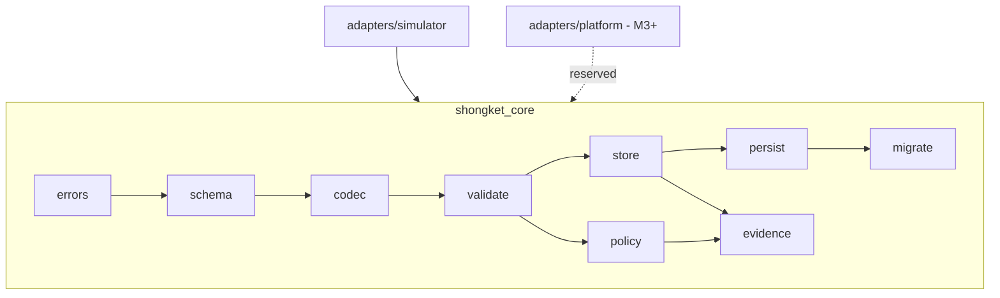
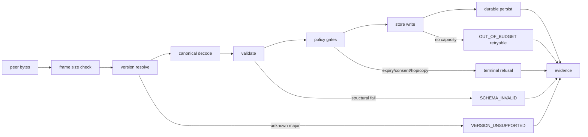
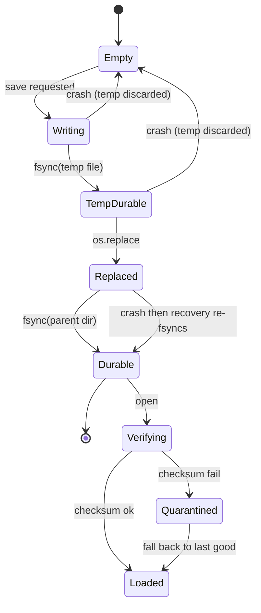
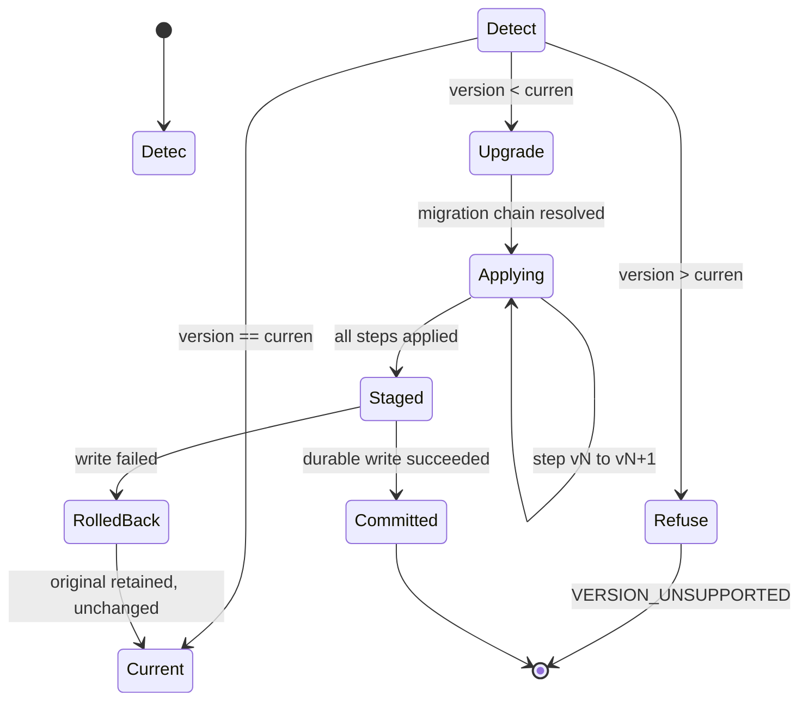
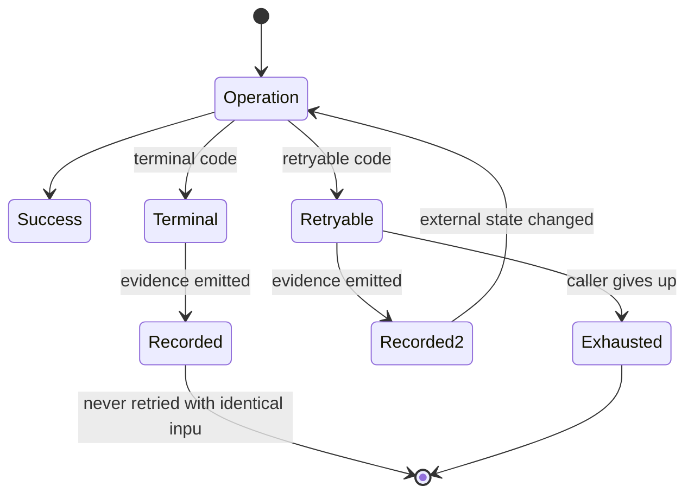

# Shongket — Milestone 1 Scope Freeze

**Status:** Design decisions ACCEPTED and Milestone 1 approved for
implementation. `PRODUCT_DECISIONS.md` is the canonical status source
and now reads `IMPLEMENTATION_STATUS: APPROVED_FOR_MILESTONE_1`.

All thirteen decisions in §5 are accepted and encoded into the canonical
documents. The scope was frozen and merged **before** approval, so this
document describes the scope that was approved rather than one written
afterwards.

Authorised work is limited to the scope in §1 and the slices in §8.
Android, radios, offline AI inference, production security, eviction and
all Milestone 2+ work remain unauthorised.

**Progress — M1 overall: COMPLETE.** All five slices are implemented and
all sixteen M1-blocking acceptance IDs pass (367 tests, 0 failed,
0 skipped). `IMPLEMENTATION_STATUS` remains
`APPROVED_FOR_MILESTONE_1`; Milestone 2 is neither approved nor started.

| Slice | Status |
|---|---|
| Slice 1 — canonical serialization, schema registry, version handling | **IMPLEMENTED** in `shongket_core/`; AT-22, AT-23, AT-24 pass |
| Slice 2 — durable atomic persistence | **IMPLEMENTED**; AT-26, AT-27, AT-28, AT-30, AT-31 pass |
| Slice 3 — migration, rollback, corrupted-state handling | **IMPLEMENTED**; AT-25, AT-29, AT-36 pass |
| Slice 4 — privacy rules, `public_only`, failure taxonomy | **IMPLEMENTED**; AT-32, AT-33, AT-34, AT-35 pass |
| Slice 5 — conformance suite, adapter isolation, golden vectors | **IMPLEMENTED**; AT-37 passes |

All sixteen M1-blocking acceptance IDs (AT-22 … AT-37) are implemented
and passing. Measured evidence is recorded in `ACCEPTANCE_TESTS.md` and
`EXPERIMENT_PLAN.md`.

Baseline this freeze was written against:

- `main` at merge commit `b5cc2aa` (PR #1);
- 18 of 18 M0-blocking acceptance IDs complete;
- 125 automated tests passing, 0 failed, 0 skipped;
- deterministic CLI `D5AC79B1…2CB4DF` (3114 B) and metrics
  `E10E11D4…891B28` (1580 B).

---

## 1. Canonical M1 scope

Taken from `MILESTONES.md` § Milestone 1, unchanged in meaning:

- **Objective:** harden M0 into a production-quality core suitable for
  Android integration in later milestones.
- **Deliverables:** stable schemas with explicit versioning; robus
  persistence (durable, crash-safe, schema-versioned); explicit failure
  handling; protocol conformance test suite.
- **Acceptance criteria:** all M0 acceptance tests pass; additional M1
  conformance tests pass; persistence survives crash and continues
  in-progress transfers.
- **Explicitly excluded (canonical):** new product features vs. M0; AI
  extraction; Android-specific UI.
- **Primary risks (canonical):** scope creep; premature optimization.

## 2. Explicit M1 exclusions

M1 does **not** include: Android application or UI; Bluetooth; Wi-Fi
Direct; Nearby Connections; any real radio transport; real offline AI
inference; production encryption or cryptographic identity;
Bloom-filter inventory; Reed-Solomon, fountain codes or RaptorQ; field
trials; or any Milestone 2+ work.

M1 adds **no new product behaviour**. Every M1 change is one of:
stabilisation, versioning, durability, validation, failure handling,
migration, or test coverage.

---

## 3. Existing M1 requirements found in the canonical documents

| Source | Requirement |
|---|---|
| `MILESTONES.md` §M1 | Stable schemas + explicit versioning; robust persistence; explicit failure handling; conformance suite |
| `MILESTONES.md` §M2 | M2 depends on M1 acceptance and runs the M1 core across **two OS processes** — so M1 must define concurrency and locking assumptions |
| `MILESTONES.md` §M3 | M3 connects "the M1 core" to Android transport — M1 must therefore be transport-neutral and adapter-shaped |
| `PROTOCOL_SPEC.md` §9 | Version field per schema; minor bump = additive, unknown fields ignored; major bump = breaking, reject with `VERSION_UNSUPPORTED`; mismatch must never cause partial decode |
| `PROTOCOL_SPEC.md` §3 preamble | "Limits are targets; **final values are decided at M1**" — every size limit must be frozen at M1 |
| `PROTOCOL_SPEC.md` §3.2 | Manifest validation must check `object_id`, signatures, `expires_at` parseability, per-field limits |
| `PROTOCOL_SPEC.md` §6.0 | Forwarding policy: accept iff not expired **and** `hop_count + 1 ≤ hop_limit` **and** local copy count `+ 1 ≤ copy_budget` |
| `SYSTEM_ARCHITECTURE.md` §2 | Persistence Layer is "Durable (**or in-memory for M0**) storage behind interface" — M1 owes the durable implementation |
| `SYSTEM_ARCHITECTURE.md` §3 | Must survive restart, interruption, peer loss, insufficient storage, malformed payload, protocol-version mismatch — "without crashing or silently corrupting state", with logged recovery |
| `MEDIA_PIPELINE.md` §6 | M1 adds per-modality `MediaPipeline` implementations with explicit synthetic-input test coverage |
| `RISK_REGISTER.md` R-12 | Malicious peer payloads — schema validation, size limits, signature checks (M1+) |
| `RISK_REGISTER.md` R-13 | Fragment flooding / resource exhaustion — per-peer caps, rate limits, object caps (M1, M3) |
| `ACCEPTANCE_TESTS.md` §severity | S2 = "blocks M1 approval" — AT-12 and AT-14 carry S2 |
| `AGENTS.md` | Protocol logic independent of Android APIs; pure protocol testable without devices; all payloads validated and size-limited |

---

## 4. Contradictions and missing definitions

All nine are now **RECONCILED** by the accepted decisions. The findings
are retained below unchanged, as the record of what M0 actually lef
open. Resolutions:

| ID | Finding | Resolution | Encoded in |
|---|---|---|---|
| C-1 | Flat `…v1` cannot express the minor-bump rule | D-M1-05: `v<major>.<minor>`, `…v1` aliases `…v1.0` | `PROTOCOL_SPEC.md` §9.1 |
| C-2 | Spec says RFC3339 strings; code uses `*_unix` integers | D-M1-A1: integer seconds are canonical for v1.0 | `PROTOCOL_SPEC.md` §9.2 |
| C-3 | `hop_limit` / `copy_budget` declared, never enforced; no `hop_count` | D-M1-A3: enforce both; add forwarding-state `hop_count` and `remaining_copy_budget`, excluded from identity | `PROTOCOL_SPEC.md` §3.2, §6 |
| C-4 | 7 canonical codes unreachable; 5 raised codes not canonical | D-M1-07: single canonical enum, all codes classified | `PROTOCOL_SPEC.md` §3.8 |
| C-5 | No directory fsync, no document checksum, no lock, no migration | D-M1-06: full durable model | `SYSTEM_ARCHITECTURE.md` §3.1, §3.3 |
| C-6 | AT-12 eviction split unresolved | D-M1-04: rejection-only at M1; eviction stays M5+ | `SYSTEM_ARCHITECTURE.md` §3.2 |
| C-7 | Privacy field names provisional | D-M1-01 / D-M1-02: `visibility` enum + strict boolean consent | `PROTOCOL_SPEC.md` §3.2 |
| C-8 | `MEDIA_PIPELINE.md` §6 M1 wording references `android.media` | Read as interface shaping only; D-M1-08 forbids any Android dependency in M1 | `SYSTEM_ARCHITECTURE.md` §3.4 |
| C-9 | No coverage for versioning, migration, rollback, retryability | AT-22 … AT-37 adopted | `ACCEPTANCE_TESTS.md` |

C-8 note: `MEDIA_PIPELINE.md` §6 is left as written. Its M1 sentence
describes *neutrally referenced* APIs and makes no APK-level commitment,
which is consistent with D-M1-08 forbidding any Android dependency in
the M1 core. Should that sentence later be read as authorising an
Android dependency, D-M1-08 governs.

### C-1 — Schema version format cannot express the versioning rule

`PROTOCOL_SPEC.md` §9 requires "bump **minor**" for additive changes and
"bump **major**" for breaking ones. Every implemented schema string is
flat: `shongket.capsule.v1`, `shongket.content.v1`,
`shongket.fragment.v1`, `shongket.snapshot.v1`, `shongket.error.v1`,
`shongket.fragreq.v1`, `shongket.manualform.v1`, `shongket.metrics.v1`.
There is **no minor component**, so the canonical rule is currently
unimplementable as written.

### C-2 — Timestamp fields diverge from the specification in name and type

`PROTOCOL_SPEC.md` §3.2 declares `"created_at": "RFC3339 timestamp"` and
`"expires_at": "RFC3339 timestamp or null"`. The implementation uses
`created_at_unix` and `expires_at_unix` as **integers**. The integer
form is what makes M0 deterministic (no timezone or format parsing), so
the implementation is defensible — but spec and code disagree today.

### C-3 — `hop_limit` and `copy_budget` are declared but never enforced

Both are carried in the manifest and type-validated
(`validation.py:279-282`), and `PROTOCOL_SPEC.md` §6.0 makes them
forwarding preconditions. **Neither is enforced anywhere.** There is
also no `hop_count` field in any schema, so the hop rule has no input.
M0 enforces only the expiry clause of the three-part policy.

### C-4 — Error taxonomy has diverged substantially

Canonical `shongket.error.v1` enum (§3.8) versus codes actually raised:

| Canonical, never raised | Raised, not canonical | In both |
|---|---|---|
| `VERSION_UNSUPPORTED`, `SIGNATURE_INVALID`, `EXPIRED`, `HOP_LIMIT`, `COPY_BUDGET`, `UNKNOWN_OBJECT`, `INTERNAL` | `HUMAN_CONFIRMATION_MISSING`, `CONSENT_REQUIRED`, `OUT_OF_BUDGET`, `SNAPSHOT_INVALID`, `SNAPSHOT_CORRUPTED` | `SCHEMA_INVALID`, `PAYLOAD_TOO_LARGE` |

7 canonical codes are unreachable; 5 implemented codes are absent from
the canonical enum. Note `EXPIRED` is canonical but M0 refuses expired
content at queue admission without raising, which is a deliberate design
choice that the enum does not describe.

### C-5 — Snapshot durability is incomplete

`persistence.py` writes to a temp file, `fsync`s **the file**, then
`os.replace`. It never `fsync`s the **parent directory**, so on POSIX
the rename itself may not survive a crash. There is also no
document-level checksum (only per-fragment SHA-256), no file locking,
and no migration path — the schema string is matched exactly, so any
future version is simply rejected as `SNAPSHOT_INVALID`.

### C-6 — AT-12 eviction remains spli

`ACCEPTANCE_TESTS.md` AT-12 expects "eviction policy engages" while
scoping itself "M0 (rule), M5+ (effect)". M0 implements refusal only.
Whether M1 owes any eviction behaviour is undecided.

### C-7 — Privacy field names are provisional

Carried forward from M0 and already recorded in `PRODUCT_DECISIONS.md`:
`private` and `forwarding_consent` are simulator-local names with no
schema backing in `PROTOCOL_SPEC.md` §3.

### C-8 — `MEDIA_PIPELINE.md` §6 M1 wording touches Android

It says M1 should "begin transition … using only `android.media` /
equivalent neutrally referenced APIs". This sits uneasily beside the M1
exclusion of Android work. Reading it as *interface shaping only, no
Android dependency* is the only interpretation consistent with
`MILESTONES.md`; this needs confirming.

### C-9 — Missing acceptance coverage for M1 concerns

No existing AT covers: serialization stability across versions, version
negotiation, migration, rollback, partial-write recovery, retryable vs
terminal error classification, or concurrency. All are new at M1.

---

## 5. Accepted decisions

All decisions below are **ACCEPTED**. Each recommendation was adopted as
proposed; the rationale and rejected alternatives are retained so the
reasoning stays auditable. Where a decision is now encoded in a
canonical document, the location is named.

### D-M1-01 — Privacy classification field

**ACCEPTED** — encoded in `PROTOCOL_SPEC.md` §3.2. Freeze `visibility`
as a required manifest enum with
values `"public" | "private"`, defaulting to `"public"` when absent, and
retire the provisional boolean `private`.

- Type: string enum. Malformed or unknown value → rejec
  `SCHEMA_INVALID` before scheduling (never silently treated as public).
- Compatibility: M0 manifests carrying boolean `private` are accepted by
  a migration that maps `true → "private"`, `false → "public"`.
- Rationale: an enum extends cleanly (e.g. `"contacts_only"` later)
  where a boolean does not; `PeerCapabilities.public_only` already
  frames the domain in public/private terms rather than a negation.
- Trade-off: slightly larger payload than a boolean; requires migration.
- Alternative: keep boolean `private`. Smaller and already implemented,
  but cannot express a third class without a breaking change.

### D-M1-02 — Forwarding consent field

**ACCEPTED** — encoded in `PROTOCOL_SPEC.md` §3.2. Freeze
`forwarding_consent` as a **strictly boolean**
manifest field, absent-or-`false` meaning "no consent", with only
literal `true` granting it.

- Malformed (string, int, null) → reject `CONSENT_REQUIRED` with
  `consent_malformed` evidence; never coerced.
- Only consulted when `visibility == "private"`.
- Rationale: preserves the M0 behaviour already proven by 13 tests;
  strict typing means an ambiguous value can never be read as consent.
- Trade-off: carries no record of *who* consented or *when*. A richer
  `{granted, actor, at}` object was considered and rejected for M1 as
  new product functionality, which M1 forbids.

### D-M1-03 — `PeerCapabilities.public_only`

**ACCEPTED:** `public_only: true` means the peer deals in **public
content only**. It may receive, request, advertise and forward public
content, and none of those operations for private content.

- Accepted scope is **broader than originally proposed**. The draf
  restricted only *sending to* and *forwarding through* such a peer,
  leaving request, advertise and receive unconstrained; the accepted
  reading covers all four operations. A peer that declares it handles
  only public content should not be asked to request or advertise
  private content either.
- Enforcement point: before queueing and before transmission — the same
  boundary as expiry and consent, so nothing is scheduled or sent.
- Interaction: a private object with valid consent is still **not** sen
  to a `public_only` peer. Consent authorises forwarding in general; i
  does not override a peer's declared refusal.
- Evidence: deterministic refusal naming the failing clause, error code
  `PEER_REFUSES_PRIVATE`.
- Encoded in: `PROTOCOL_SPEC.md` §6 (admission clause 6 and the
  `public_only` subsection).

### D-M1-04 — Storage pressure and eviction

**ACCEPTED** — encoded in `SYSTEM_ARCHITECTURE.md` §3.2. M1 **continues
rejection-only** behaviour. No eviction.

- Rationale: AT-12 itself scopes the effect to M5+;
  `SYSTEM_ARCHITECTURE.md` assigns eviction to the device path; and
  eviction is new product behaviour, which M1 forbids. M1 instead owes
  the *durability* of the existing rule: budget accounting must survive
  crash and restart exactly.
- What must never be evicted (recorded now, for M5+): human-confirmed
  capsules; manifests for objects with any verified fragment; the
  original source representation.
- Atomicity requirement for M1: a refused write must leave byte
  accounting, fragment map and persisted state all unchanged — verified
  after a simulated crash, not only in memory.
- Alternative: implement deterministic eviction at M1 (lowest priority
  then oldest first). Rejected as scope creep, but noted as the natural
  M5+ design.

### D-M1-05 — Protocol versioning

**ACCEPTED:** move to `shongket.<object>.v<MAJOR>.<MINOR>` with these
rules:

- **Major** = breaking. A receiver seeing an unknown major rejects with
  `VERSION_UNSUPPORTED` and performs **no partial decode**.
- **Minor** = additive only, and **compatibility must be explicitly
  registered**. The exact registered version is accepted. *Any* other
  minor — numerically lower or higher — is accepted only when the
  receiver holds a registered compatibility entry for tha
  `(object, major, minor)`; otherwise it is refused with
  `VERSION_UNSUPPORTED`.
- **Ordering grants nothing.** An earlier draft of this decision said "a
  lower minor is always accepted", reasoning that an older sender is one
  we already understand. That was ratified out: a receiver holds no
  record of what an unregistered earlier release actually looked like,
  so treating "lower" as "safe" is inference from numeric ordering —
  precisely what this decision forbids. This wording previously
  contradicted `PROTOCOL_SPEC.md` §9.1; the two now agree.
- Accepted rule is **stricter than originally proposed**. The draf
  accepted any higher minor optimistically and ignored unknown fields.
  The accepted rule requires compatibility to be *declared, never
  inferred*, so a receiver cannot silently accept a payload shaped by a
  release it knows nothing about, in either direction.
- On an accepted minor, unknown fields are ignored, not persisted and
  not echoed back.
- A schema registry maps `(object, major)` to a validator and holds the
  registered minor-compatibility entries; it is the single source of
  supported versions.
- Deprecation: a major stays supported for at least one subsequent major
  release and is announced in `PROTOCOL_SPEC.md` before removal.
- Migration: persisted data migrates forward on read; wire payloads are
  never migrated, only accepted or rejected.
- Compatibility: existing `…v1` strings are read as `…v1.0` so no M0
  fixture breaks.
- Trade-off accepted: stricter minor handling means a registry entry
  must be added before a new minor can be received, which is deliberate
  — it makes compatibility an explicit act rather than an accident.
- Encoded in: `PROTOCOL_SPEC.md` §9.1.

### D-M1-06 — Persistence

**ACCEPTED** — encoded in `SYSTEM_ARCHITECTURE.md` §3.1 and §3.3.
Durable model:

- **Format:** canonical JSON document, sorted keys, `(",", ":")`
  separators — unchanged from M0 so existing snapshots stay readable.
- **Integrity:** per-fragment SHA-256 (as today) **plus** a
  document-level checksum over the canonical bytes excluding the
  checksum field itself.
- **Atomic write:** temp file → `fsync(file)` → `os.replace` →
  **`fsync(parent directory)`**. The directory fsync closes the C-5 gap.
- **Crash consistency:** a reader must see either the complete previous
  document or the complete new one, never a blend. Partial temp files
  are ignored and cleaned on next open.
- **Schema version:** `shongket.snapshot.v1.0`, migrated forward on read.
- **Migration:** pure functions `vN → vN+1`, applied in sequence, each
  independently testable; the pre-migration file is retained until the
  migrated document is durably written.
- **Corrupted state:** a failed document checksum quarantines the file
  (renamed aside, never deleted) and recovery proceeds from the las
  good snapshot; fragments failing their own SHA-256 are dropped
  individually while intact fragments are preserved.
- **Locking / concurrency:** M1 assumes **single-writer, multi-reader**
  per store path, enforced by an advisory lock file. Multi-process
  writing is explicitly out of scope until M2 defines it.
- Trade-off: the directory fsync costs latency on every save; a
  write-ahead journal would be faster for many small updates but is more
  machinery than M1's snapshot cadence justifies.

### D-M1-07 — Error taxonomy

**ACCEPTED** — encoded in `PROTOCOL_SPEC.md` §3.8. One canonical enum
shared by `ProtocolError`, acknowledgements, events and recovery
evidence, every code classified as **terminal** or **retryable**, with
the M0 codes folded in.

| Code | Class | Meaning |
|---|---|---|
| `SCHEMA_INVALID` | terminal | Structure, type or enum violation |
| `PAYLOAD_TOO_LARGE` | terminal | Exceeds a frozen size limit |
| `VERSION_UNSUPPORTED` | terminal | Unknown major version |
| `SIGNATURE_INVALID` | terminal | Signature check failed |
| `EXPIRED` | terminal | Past `expires_at` |
| `HOP_LIMIT` | terminal | `hop_count + 1 > hop_limit` |
| `COPY_BUDGET` | terminal | Replication budget exhausted |
| `CONSENT_REQUIRED` | terminal | Private object without consent |
| `HUMAN_CONFIRMATION_MISSING` | terminal | Capsule not human-confirmed |
| `PEER_REFUSES_PRIVATE` | terminal | Target peer is `public_only` |
| `UNKNOWN_OBJECT` | retryable | Referent not held yet; may arrive |
| `OUT_OF_BUDGET` | retryable | No capacity now; may free later |
| `SNAPSHOT_INVALID` | retryable | Malformed persisted document; recoverable from last good |
| `SNAPSHOT_CORRUPTED` | retryable | Integrity failure; recoverable per D-M1-06 |
| `INTERNAL` | terminal | Defect; must never be produced by valid input |

- **Terminal** = re-offering identical input must fail identically.
  **Retryable** = the same input may succeed once external state changes.
- Every raised error maps to exactly one `FragmentAck.status` where an
  ack applies, and to a deterministic evidence event otherwise.
- Trade-off: `PEER_REFUSES_PRIVATE` is a new code not in §3.8 and needs
  adding to the spec. Reusing `CONSENT_REQUIRED` would conflate an
  object-side refusal with a peer-side one and make evidence ambiguous.

### D-M1-08 — Core language and package boundary

**ACCEPTED** — encoded in `SYSTEM_ARCHITECTURE.md` §3.4. M1 **stays
Python**, adds a language-neutral protocol specification, canonical
serialization rules, golden vectors and conformance tests, and does no
port the core to Kotlin in M1.

- No canonical document requires a language at M1. M2 (two OS processes
  on a developer machine) is satisfied by Python. Only M3 introduces
  Android, and `MILESTONES.md` M3 says it "connects the M1 core to a
  real Android transport" — a boundary, not a rewrite mandate.
- Proposed boundary: a platform-neutral `shongket_core` package tha
  never imports an adapter, with the simulator demoted to
  `adapters/simulator`. See §6.
- M0 compatibility is preserved by keeping the existing simulator
  entry points working against the new core, with AT-37 as the
  regression gate.
- **Alternatives considered.** *Rewrite in Kotlin/JVM at M1*: removes a
  future port and is JVM-native for M3, but discards 125 passing tests
  and 18 acceptance IDs of evidence, and is precisely the "scope creep"
  M1 names as its primary risk. *Kotlin Multiplatform*: maximum reach,
  largest toolchain cost, and adds a dependency stack M1 forbids.
- Recommendation stands on the canonical requirements, **not** on the
  fact that Android is planned later. Golden vectors are what make a
  later port verifiable; the language itself is not the M1 deliverable.

---

## 6. Proposed M1 architecture

### 6.1 Module boundaries

```
shongket_core/                 platform-neutral, standard library only
  errors/       error taxonomy, terminal/retryable classification
  schema/       canonical schemas, version registry, supported majors
  codec/        canonical serialization; byte-stable encode/decode
  validate/     structural, size and semantic validation
  policy/       scheduling, expiry, hop/copy budget, consent, public_only
  media/        fixed-size fragmentation, hashing, reconstruction
  store/        storage abstraction (interface + in-memory reference)
  persist/      durable snapshot, integrity, atomic write, locking
  migrate/      schema and persistence migrations, rollback
  evidence/     structured events and deterministic metrics

adapters/
  simulator/    M0-compatible peers, encounters, scenarios, CLI
  platform/     RESERVED — M3+; no M1 conten
```

### 6.2 Dependency direction



Rule: `shongket_core` must never import from `adapters/`. Enforced by a
conformance test (AT-37) that fails on any reverse import.

### 6.3 Data flow



Every rejection path terminates in evidence. No path mutates the store
before its gate has passed — the M0 validate-before-mutate invariant,
preserved.

### 6.4 Persistence state machine



### 6.5 Schema migration state machine



The pre-migration document is retained until the migrated one is durably
written, which is what makes rollback possible (AT-29).

### 6.6 Error and recovery state machine



### 6.7 M0 module disposition

| M0 module | M1 disposition | Note |
|---|---|---|
| `hashutil.py` | **Retain** | Already minimal and correct |
| `chunks.py` | **Retain** → `core/media` | Fixed-size fragmenter unchanged |
| `media.py` | **Retain** → test fixtures | Synthetic source generator; not core |
| `capsule.py` | **Adapt** | Remove `time.time()` fallback |
| `manifest.py` | **Adapt** | Remove `time.time()` fallback; resolve C-2 |
| `validation.py` | **Replace** | Split into `errors` / `schema` / `codec` / `validate` |
| `priority.py` | **Adapt** | Add hop/copy enforcement (C-3) |
| `store.py` | **Adapt** | Extract interface; keep budget semantics |
| `persistence.py` | **Replace** | Durability, checksum, locking, migration (C-5) |
| `events.py` | **Adapt** | Move to `evidence`; stable event contract |
| `metrics.py` | **Adapt** | Move to `evidence` |
| `gate.py` | **Adapt** | Freeze consent fields per D-M1-01/02/03 |
| `ingress.py` | **Adapt** | Reuse as the scheduling boundary |
| `peer.py`, `transfer.py`, `scenario.py`, `main.py` | **Move** → `adapters/simulator` | Behaviour preserved; AT-37 guards |

Nothing in the table deletes M0 behaviour. Every M0 acceptance test mus
still pass unchanged.

---

## 7. Accepted acceptance catalogue (AT-22 … AT-37)

**ID availability verified:** `ACCEPTANCE_TESTS.md` defines AT-01 … AT-21
and no higher ID appears anywhere in the repository. AT-22 onward are
free. No existing ID is reused for new behaviour.

These definitions were added to `ACCEPTANCE_TESTS.md` after scope
approval and now have complete passing evidence.

Severity: **S1** blocks M0-style release gates; per the existing scale,
**S2 blocks M1 approval**. M1-blocking rows below are marked S2 or S1 as
indicated.

| ID | Title | Blocking |
|---|---|---|
| AT-22 | Canonical serialization is byte-stable | M1-blocking (S2) |
| AT-23 | Compatible minor-version payload accepted | M1-blocking (S2) |
| AT-24 | Unsupported major version rejected | M1-blocking (S2) |
| AT-25 | Deterministic persistence migration | M1-blocking (S2) |
| AT-26 | Crash-safe atomic snapshot write | M1-blocking (S2) |
| AT-27 | Partial-write recovery | M1-blocking (S2) |
| AT-28 | Corrupted-snapshot recovery | M1-blocking (S2) |
| AT-29 | Rollback after failed migration | M1-blocking (S2) |
| AT-30 | Verified fragments preserved across all recovery paths | M1-blocking (S1) |
| AT-31 | Deterministic restart behaviour | M1-blocking (S2) |
| AT-32 | Error classification is complete and canonical | M1-blocking (S2) |
| AT-33 | Retryable versus terminal failure behaviour | M1-blocking (S2) |
| AT-34 | Privacy/consent field compatibility and migration | M1-blocking (S2) |
| AT-35 | `public_only` peer refusal | M1-blocking (S2) |
| AT-36 | Persistence schema upgrade end-to-end | M1-blocking (S2) |
| AT-37 | M0 regression and core/adapter isolation | M1-blocking (S1) |

### AT-22 Canonical serialization is byte-stable

- **Preconditions:** a populated object of each canonical schema.
- **Input:** each object encoded, decoded and re-encoded.
- **Steps:** encode → decode → encode; compare byte strings; repeat in a
  fresh process.
- **Expected:** both encodings byte-identical; key order and separators
  stable; no float formatting divergence; identical across processes.
- **Automation:** harness. **Milestone:** M1. **Severity:** S2.
- **Evidence:** SHA-256 of each encoding, recorded per schema.
- **Runtime boundary:** `core/codec`.

### AT-23 Compatible minor-version payload accepted

- **Preconditions:** registry supports major `1`.
- **Input:** a payload declaring a higher minor and carrying one unknown
  additional field.
- **Steps:** submit to the validation boundary.
- **Expected:** accepted; unknown field ignored, not persisted, no
  echoed; no error raised; known fields validated normally.
- **Automation:** harness. **Milestone:** M1. **Severity:** S2.
- **Evidence:** acceptance log naming the ignored field.
- **Runtime boundary:** `core/schema` + `core/validate`.

### AT-24 Unsupported major version rejected

- **Preconditions:** registry supports major `1` only.
- **Input:** a payload declaring major `2`; and a second payload that is
  both major `2` **and** structurally malformed.
- **Steps:** submit each.
- **Expected:** both rejected with `VERSION_UNSUPPORTED` (never
  `SCHEMA_INVALID`, proving version is resolved before structural
  parsing); **no partial decode**; nothing scheduled or persisted.
- **Automation:** harness. **Milestone:** M1. **Severity:** S2.
- **Evidence:** rejection log with code and declared version.
- **Runtime boundary:** `core/schema`.

### AT-25 Deterministic persistence migration

- **Preconditions:** a snapshot at version N; current version N+1.
- **Input:** the vN snapshot.
- **Steps:** open; migrate; write; repeat the whole sequence twice from
  identical starting bytes.
- **Expected:** migrated document identical byte-for-byte across both
  runs; every verified fragment preserved with matching SHA-256;
  migration chain applied in order.
- **Automation:** harness. **Milestone:** M1. **Severity:** S2.
- **Evidence:** SHA-256 before and after; migration step log.
- **Runtime boundary:** `core/migrate`.

### AT-26 Crash-safe atomic snapshot write

- **Preconditions:** an existing durable snapshot.
- **Input:** a new save interrupted at each stage — after temp write,
  after temp fsync, after replace, before directory fsync.
- **Steps:** simulate interruption at each point; reopen.
- **Expected:** the reader always sees either the complete previous
  document or the complete new one, never a blend; no partial documen
  is ever loaded; temp artefacts are ignored and cleaned.
- **Automation:** harness (fault injection, no real power loss).
- **Milestone:** M1. **Severity:** S2.
- **Evidence:** per-stage recovery log and resulting document checksum.
- **Runtime boundary:** `core/persist`.

### AT-27 Partial-write recovery

- **Preconditions:** a durable snapshot plus a truncated temp file.
- **Input:** a temp file containing a prefix of a valid document.
- **Steps:** open the store.
- **Expected:** the truncated temp is ignored and removed; the previous
  durable snapshot loads intact; no exception escapes; recovery is
  logged.
- **Automation:** harness. **Milestone:** M1. **Severity:** S2.
- **Evidence:** recovery log naming the discarded artefact.
- **Runtime boundary:** `core/persist`.

### AT-28 Corrupted-snapshot recovery

- **Preconditions:** a durable snapshot with a valid last-good copy.
- **Input:** (a) document checksum corrupted; (b) one fragment's bytes
  corrupted while the document checksum is valid.
- **Steps:** open the store for each case.
- **Expected:** (a) file quarantined — renamed aside, **never deleted** —
  and the last good snapshot loads; (b) only the corrupt fragment is
  dropped, every intact fragment is preserved, and the loss is logged.
- **Automation:** harness. **Milestone:** M1. **Severity:** S2.
- **Evidence:** quarantine path and per-fragment integrity report.
- **Runtime boundary:** `core/persist`.

### AT-29 Rollback after failed migration

- **Preconditions:** a vN snapshot; a migration that fails mid-chain.
- **Input:** an injected failure during the durable write of the
  migrated document.
- **Steps:** attempt migration; fail; reopen.
- **Expected:** the original vN document remains readable and
  byte-identical to before the attempt; no partially migrated state is
  visible; the failure is logged as retryable.
- **Automation:** harness. **Milestone:** M1. **Severity:** S2.
- **Evidence:** pre/post SHA-256 of the original document.
- **Runtime boundary:** `core/migrate` + `core/persist`.

### AT-30 Verified fragments preserved across all recovery paths

- **Preconditions:** a store holding N verified fragments.
- **Input:** each recovery path exercised — restart, partial write,
  corrupted document, failed migration, refused over-budget write.
- **Steps:** run each path; enumerate surviving fragments.
- **Expected:** every fragment that was verified before the event is
  present afterwards with its original SHA-256, except a fragment whose
  own bytes were deliberately corrupted; byte accounting matches a
  recomputed sum in every case.
- **Automation:** harness. **Milestone:** M1. **Severity:** S1.
- **Evidence:** fragment inventory and byte accounting before and after.
- **Runtime boundary:** `core/store` + `core/persist`.

### AT-31 Deterministic restart behaviour

- **Preconditions:** an interrupted transfer with partial progress.
- **Input:** identical starting state, restarted twice.
- **Steps:** interrupt; restart; resume; capture the event log.
- **Expected:** both runs produce byte-identical event logs and
  identical resulting stores; only missing chunks are requested after
  restart.
- **Automation:** harness. **Milestone:** M1. **Severity:** S2.
- **Evidence:** SHA-256 of both event logs.
- **Runtime boundary:** `core/persist` + `adapters/simulator`.

### AT-32 Error classification is complete and canonical

- **Preconditions:** the frozen taxonomy of D-M1-07.
- **Input:** one triggering condition per code.
- **Steps:** trigger each; capture code and classification.
- **Expected:** every raised code exists in the canonical enum; every
  enum member is reachable by at least one test or explicitly recorded
  as unreachable-by-design with a reason; each carries exactly one
  terminal/retryable classification.
- **Automation:** harness. **Milestone:** M1. **Severity:** S2.
- **Evidence:** code-coverage matrix over the enum.
- **Runtime boundary:** `core/errors`.

### AT-33 Retryable versus terminal failure behaviour

- **Preconditions:** the classification from AT-32.
- **Input:** a terminal failure re-offered with identical input; a
  retryable failure re-offered after the blocking condition clears.
- **Steps:** offer, re-offer, compare.
- **Expected:** terminal fails identically every time with no state
  change; retryable succeeds once external state permits; neither
  mutates state on the failing attempt.
- **Automation:** harness. **Milestone:** M1. **Severity:** S2.
- **Evidence:** paired attempt logs with state snapshots.
- **Runtime boundary:** `core/errors` + `core/store`.

### AT-34 Privacy/consent field compatibility and migration

- **Preconditions:** decisions D-M1-01 and D-M1-02 approved.
- **Input:** an M0-shaped manifest using boolean `private`; a frozen
  manifest using `visibility`; malformed values of each.
- **Steps:** migrate the M0 shape; validate all; attempt forwarding.
- **Expected:** `private: true → visibility: "private"` and
  `false → "public"`; absent `visibility` defaults to `"public"`;
  malformed `visibility` → `SCHEMA_INVALID`; non-boolean
  `forwarding_consent` → `CONSENT_REQUIRED`; every M0 AT-16 assertion
  still holds after migration.
- **Automation:** harness. **Milestone:** M1. **Severity:** S2.
- **Evidence:** migration log plus the AT-16 refusal matrix re-run.
- **Runtime boundary:** `core/migrate` + `core/policy`.

### AT-35 `public_only` peer refusal

- **Preconditions:** decision D-M1-03 approved.
- **Input:** a private object **with valid consent**, targeted at a peer
  declaring `public_only: true`; the same object to a normal peer; a
  public object to the `public_only` peer.
- **Steps:** attempt forwarding in each case.
- **Expected:** refused for the first with `PEER_REFUSES_PRIVATE` before
  transmission, receiver storage unchanged; permitted for the second and
  third. Consent does not override the peer's declared refusal.
- **Automation:** harness. **Milestone:** M1. **Severity:** S2.
- **Evidence:** `FORWARD_REFUSED` with `reason: "peer_public_only"`.
- **Runtime boundary:** `core/policy`.

### AT-36 Persistence schema upgrade end-to-end

- **Preconditions:** a populated vN store from a prior release.
- **Input:** the vN store opened by the current build.
- **Steps:** open; migrate; resume an in-progress transfer; restart;
  reopen.
- **Expected:** upgrade is transparent to the caller; the in-progress
  transfer resumes without re-requesting verified chunks; the store is
  at the current version afterwards; a second open performs no further
  migration.
- **Automation:** harness. **Milestone:** M1. **Severity:** S2.
- **Evidence:** version before/after and resumed-chunk list.
- **Runtime boundary:** `core/migrate` + `adapters/simulator`.

### AT-37 M0 regression and core/adapter isolation

- **Preconditions:** the M1 refactor complete.
- **Input:** the full M0 acceptance suite; a static import scan.
- **Steps:** run all M0 tests unmodified; scan `shongket_core` imports;
  re-run the deterministic CLI and metrics.
- **Expected:** all 125 M0 tests pass **unchanged**; `shongket_core`
  imports nothing from `adapters/` or any non-standard-library package;
  CLI and metrics hashes match the recorded M0 values, or any change is
  explicitly justified and re-approved.
- **Automation:** harness. **Milestone:** M1. **Severity:** S1.
- **Evidence:** test counts, import scan output, both hashes.
- **Runtime boundary:** whole package.

### Classification summary

- **M1-blocking:** AT-22 … AT-37 (all sixteen).
- **M1 non-blocking:** none proposed — anything non-blocking belongs to a
  later milestone rather than diluting the M1 gate.
- **Later-device tests:** AT-12 eviction *effect* (M5+), AT-13
  permissions (M5+), AT-14 offline behaviour (M5+).
- **Real-device-only:** AT-19 demo readiness (M9); all throughput,
  memory, energy and radio measurements.

---

## 8. Approved implementation slices

Each slice was one independently verifiable commit boundary and lef
the suite green. All five are complete.

### Slice 1 — Canonical serialization, schema registry, versioning

- **Behaviours:** byte-stable encode/decode; `v<MAJOR>.<MINOR>` parsing;
  registry of supported majors; minor-tolerant acceptance; unsupported
  major rejection before parsing.
- **Modules:** `core/errors`, `core/schema`, `core/codec`,
  `core/validate` (from `validation.py`).
- **Acceptance IDs:** AT-22, AT-23, AT-24.
- **Dependencies:** D-M1-05, D-M1-07.
- **Risks:** changing the version string could alter CLI output bytes and
  break the recorded M0 hash.
- **Rollback:** revert the commit; M0 `…v1` aliases keep fixtures valid.
- **Verify:** `pytest app/simulator/tests -q` (125 pass) + new AT-22/23/24;
  CLI hash compared against the recorded M0 value.

### Slice 2 — Durable atomic persistence and integrity

- **Behaviours:** document checksum; temp → fsync → replace → **dir
  fsync**; advisory single-writer lock; partial-write cleanup;
  quarantine on checksum failure.
- **Modules:** `core/persist` (replaces `persistence.py`), `core/store`
  interface extraction.
- **Acceptance IDs:** AT-26, AT-27, AT-28, AT-30, AT-31.
- **Dependencies:** Slice 1; D-M1-06.
- **Risks:** fault injection is platform-sensitive; Windows and POSIX
  differ on rename and directory fsync semantics.
- **Rollback:** revert; M0 snapshots remain readable (format unchanged).
- **Verify:** full suite + fault-injection tests; AT-07 must still pass
  unmodified.

### Slice 3 — Migration, rollback, corrupted-state handling

- **Behaviours:** ordered `vN → vN+1` chain; retain-original-until-durable;
  rollback on failure; idempotent re-open.
- **Modules:** `core/migrate`.
- **Acceptance IDs:** AT-25, AT-29, AT-36.
- **Dependencies:** Slice 2.
- **Risks:** a migration bug can corrupt real progress — mitigated by
  retaining the pre-migration document and by AT-29.
- **Rollback:** revert; stores stay at the prior version and still load.
- **Verify:** full suite + migration tests run twice for byte equality.

### Slice 4 — Frozen privacy rules, `public_only`, failure taxonomy

- **Behaviours:** `visibility` enum with migration from boolean
  `private`; strict boolean consent; `public_only` sender-side refusal;
  hop/copy budget enforcement (closes C-3); complete error taxonomy with
  terminal/retryable classification.
- **Modules:** `core/policy` (from `gate.py`, `priority.py`),
  `core/errors`.
- **Acceptance IDs:** AT-32, AT-33, AT-34, AT-35.
- **Dependencies:** Slices 1–3; D-M1-01, D-M1-02, D-M1-03, D-M1-07.
- **Risks:** hop/copy enforcement is genuinely *new* refusal behaviour —
  it must be framed as completing a canonical §6.0 rule M0 lef
  unimplemented, not as a new feature. Needs explicit confirmation a
  approval.
- **Rollback:** revert; M0 consent behaviour is unaffected.
- **Verify:** full suite; AT-16 assertions re-run post-migration.

### Slice 5 — Conformance suite, adapter isolation, golden vectors

- **Behaviours:** simulator moved under `adapters/simulator`; impor
  isolation enforced; golden test vectors published for a future port.
- **Modules:** package restructure; no behaviour change.
- **Acceptance IDs:** AT-37.
- **Dependencies:** Slices 1–4; D-M1-08.
- **Risks:** the move touches every import path; highest regression risk
  of the five, which is why it is last and gated by AT-37.
- **Rollback:** revert the restructure commit alone.
- **Verify:** all M0 + M1 tests; import scan; CLI and metrics hashes.

---

## 9. Risks and rollback

| Risk | Likelihood | Impact | Mitigation | Rollback |
|---|---|---|---|---|
| Scope creep into M2+ behaviour | M | H | Every slice maps to a canonical requirement; hop/copy flagged for explicit confirmation | Revert slice |
| Refactor breaks M0 evidence | M | H | AT-37 gates on all 125 tests unchanged plus recorded hashes | Revert; `main` retains M0 |
| Migration corrupts real progress | L | H | Retain pre-migration document until durable; AT-29 | Original document still loads |
| Version-string change alters CLI bytes | M | M | Alias `…v1` to `…v1.0`; compare hashes each slice | Revert Slice 1 |
| Platform-divergent fsync semantics | M | M | Test on the target platform; document Windows/POSIX differences | Keep M0 write path |
| Premature optimisation | M | M | No performance work in M1; no benchmarks invented | n/a |

Repository-level rollback: every slice is one commit on a feature
branch; `main` retains the complete, merged M0 evidence throughout.

---

## 10. Approval checklis

Milestone 1 implementation may begin only when **all** of these are true:

- [x] D-M1-01 privacy classification field decided
- [x] D-M1-02 forwarding consent field decided
- [x] D-M1-03 `public_only` semantics decided
- [x] D-M1-04 storage pressure / eviction decided
- [x] D-M1-05 protocol versioning decided
- [x] D-M1-06 persistence model decided
- [x] D-M1-07 error taxonomy decided
- [x] D-M1-08 core language and package boundary decided
- [x] C-2 timestamp naming reconciled in `PROTOCOL_SPEC.md` §9.2
- [x] C-3 hop/copy enforcement confirmed as in-scope for M1
- [x] C-8 `MEDIA_PIPELINE.md` M1 wording confirmed as interface-only
- [x] AT-22 … AT-37 approved and added to `ACCEPTANCE_TESTS.md`
- [x] `PROTOCOL_SPEC.md` size limits frozen (§9.3)
- [x] **`MILESTONES.md` M1 status changed by the user** —
      `APPROVED_FOR_MILESTONE_1`
- [x] **`PRODUCT_DECISIONS.md` `IMPLEMENTATION_STATUS` changed by the**
      **user to `APPROVED_FOR_MILESTONE_1`**

All fifteen items are complete. The final two were the user's approval
acts, taken only after the frozen scope had been reviewed and merged.

Milestone 1 implementation was authorised **within this scope only**.
It is now complete: all five slices and AT-22 through AT-37 have passing
evidence. This approval still does not authorise M2 or later work.
