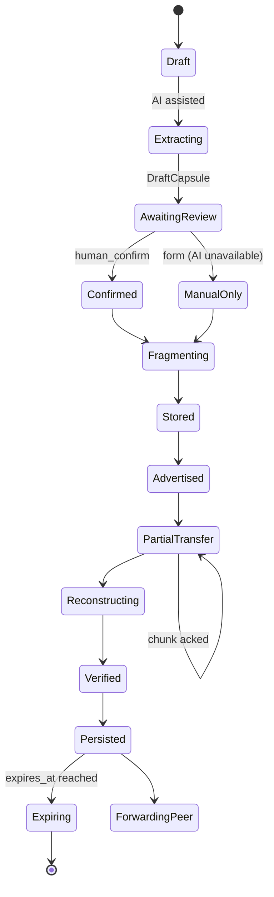
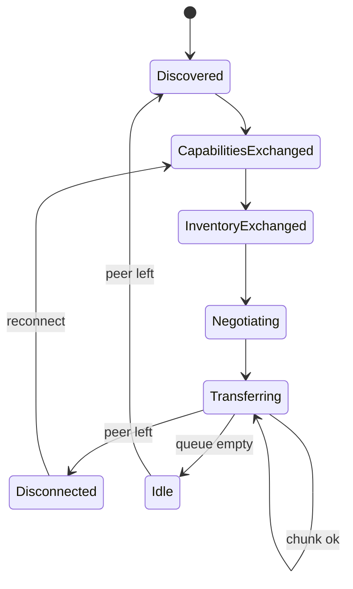
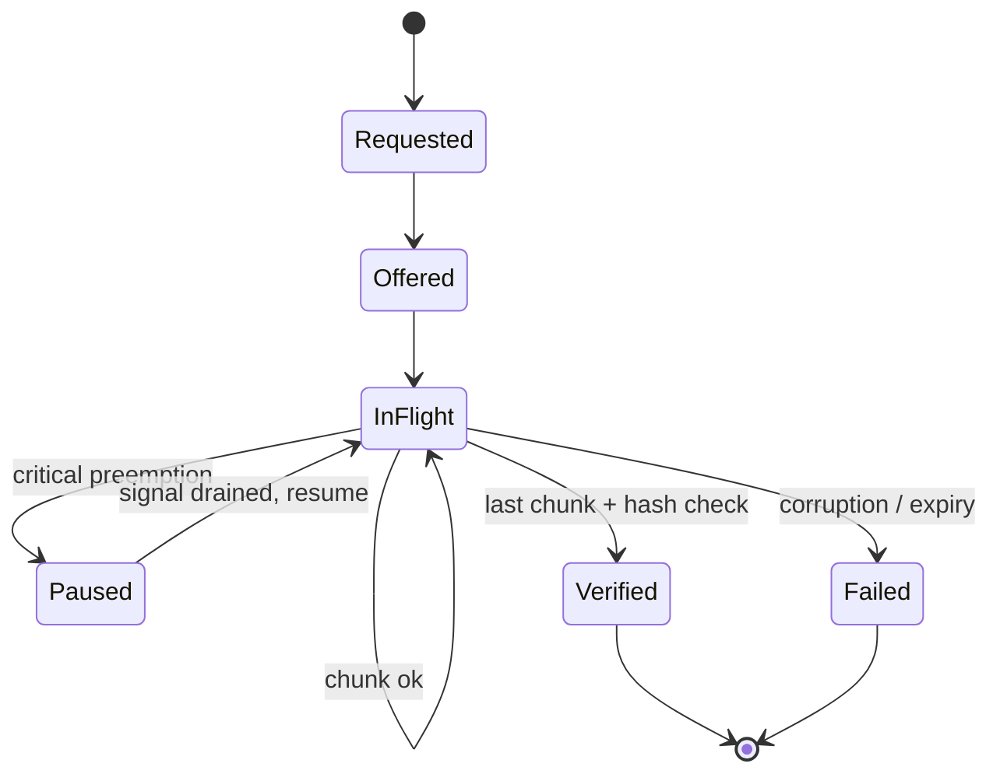
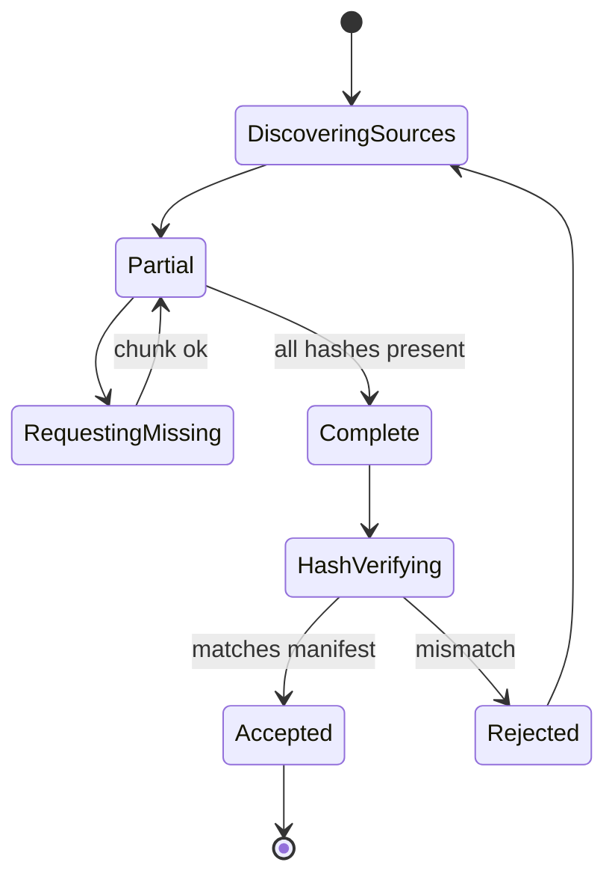

# Shongket — Protocol Specification

**Status:** M0 and M1 deterministic behaviour implemented. M2 through
M9 protocol extensions are scope-frozen and separately authorized. The
optional BDIX domestic-hub public-capsule application protocol is implemented
under its own scope and approval. Signature mechanics, radio behaviour,
cross-ISP/BDIX reachability and field results are not claimed by the completed
software baseline.

## 1. Terms

| Term | Definition |
|---|---|
| Semantic Capsule | The compact, human-confirmed structured meaning extracted from a media item. |
| Representation | A specific encoding of the source media (thumbnail, preview, standard, original). |
| Manifest | Content-addressed, signed description of an object and its representations. |
| Fragment | A byte-range piece of a representation with its own content ID and hash. |
| Source fragment | Original data chunk from a representation. |
| Recovery fragment | (Later) erasure-coded chunk, behind `FragmentationStrategy`. Not in M0. |
| Peer | Another device running Shongket. |
| Encounter | A bounded window during which two peers can exchange data. |
| Inventory | Per-peer summary of which objects / fragments are held. |
| Capability | Declared peer properties (transports, max payload, willingness to relay). |
| Priority | Class tag attached to an object (life-safety / high / routine). |
| Replication budget | Max copies of an object allowed across known peers. |
| Expiry | Absolute timestamp after which the object is no longer forwarded. |
| Content ID (CID) | Cryptographic identifier (SHA-256 over canonical form) of a content-addressed unit. |
| Domestic hub | Optional Bangladesh-hosted public-capsule endpoint reachable only while the clients' domestic ISP route survives. |

### Multi-peer completion

Completion of a representation by collecting its ordinary missing
chunks from two or more peers.

All required source chunks must eventually be obtained.

This is the Milestone 0 strategy.

### Reassembly

Ordering and combining verified ordinary chunks into their original
representation.

### Coded reconstruction

Recovery of an object using parity, erasure-coded or rateless symbols,
where the receiver may not need every original source chunk.

Examples include Reed-Solomon, fountain codes and RaptorQ.

Coded reconstruction is not implemented in Milestone 0.

---

## 2. Object lifecycle

```
Draft
  → AI-assisted extraction (uncertainty flagged)
  → Human review & correction
  → Confirmed object (capsule linked to source media)
  → Fragmentation (FixedSize SHA-256 in M0)
  → Local storage
  → Peer advertisement (signal plane, per priority)
  → Partial transfer (multiple encounters, multiple peers)
  → Forwarding (per deterministic M0 policy)
  → Reconstruction (multi-peer missing-chunk completion, M0)
  → Verification (hash + signature)
  → Expiry or deletion
```

A peer may enter this lifecycle at any point after the object has been
finalized, depending on what it first learns about the object.

---

## 3. Schemas (illustrative JSON)

For every field: **purpose / type / required / size limit / privacy /
validation.** The examples retain the original compact shape; the M1
rules below are canonical where they supersede an example. Serialized
limits are frozen in §9.3.

### 3.1 SemanticCapsule

```json
{
  "schema": "shongket.capsule.v1",
  "capsule_id": "<CID>",
  "object_ref": "<object CID>",
  "source_media_ref": "<CID of original media>",
  "extracted_fields": {
    "event_type": "flood | fire | medical | infra | safety | other",
    "location_text": "string up to 200 chars",
    "urgency": "low | medium | high | life_safety",
    "affected_people": "integer or 'unknown'",
    "required_action": "short string",
    "required_resource": "short string",
    "summary_bn": "Bangla string up to 280 chars",
    "summary_bn_en_mix": "code-switched string up to 320 chars",
    "media_timestamps": ["HH:MM:SS", "..."],
    "keyframe_cids": ["<CID>", "..."]
  },
  "uncertainty": ["location_text", "affected_people"],
  "reviewer_did_correction": true,
  "confirmation_method": "human_confirm | manual_form_only | ai_only_disabled",
  "creator_pub_key_id": "<key id>",
  "signatures": [{ "key_id": "ed25519:<id>", "sig": "<base64>" }]
}
```

- Purpose: short, structured human-meaningful description.
- All fields optional except `schema`, `capsule_id`, `object_ref`,
  `creator_pub_key_id`.
- Size limit: capsule ≤ 4 KB serialized.
- Privacy: must not include raw PII beyond what the user typed and
  confirmed; location_text is free text, not a coordinate.
- Validation: `schema` must match supported version; size bounded;
  signatures verified on receipt.

### 3.2 ContentManifest

```json
{
  "schema": "shongket.content.v1",
  "object_id": "<CID of canonical manifest bytes>",
  "capsule_ref": "<CID>",
  "representations": [
    { "id": "thumb", "kind": "image/jpeg|video/poster|text", "byte_len": 12345,
      "chunk_size": 65536, "hashes": ["<sha256>", "..."] },
    { "id": "preview", "kind": "video/mp4|image/jpeg|text", ... },
    { "id": "standard", "kind": "...", ... },
    { "id": "original", "kind": "...", ... }
  ],
  "priority": "life_safety | high | routine",
  "created_at": "RFC3339 timestamp",
  "expires_at": "RFC3339 timestamp or null",
  "hop_limit": 6,
  "copy_budget": 8,
  "signatures": [{ "key_id": "ed25519:<id>", "sig": "<base64>" }]
}
```

#### Privacy and consent fields [IMPLEMENTED — M1, D-M1-01 / D-M1-02]

M0 used provisional simulator-local names. M1 freezes them into this
schema:

| Field | Type | Default | Meaning |
|---|---|---|---|
| `visibility` | `"public" \| "private"` | `"public"` when absent | Object privacy class |
| `forwarding_consent` | boolean, strict | absent = no consent | Explicit permission to forward a private object |

- **`visibility`** is a string enum. From v1.0 onward a payload carrying
  any other value is rejected with `SCHEMA_INVALID`; an unknown value is
  never silently treated as public. Legacy boolean `private` migrates as
  `true → "private"`, `false` or absent `→ "public"`.
- **`forwarding_consent`** is consulted only when
  `visibility == "private"`. Only the literal boolean `true` grants
  consent. Absent or `false` means no consent; a truthy string or
  integer is **malformed**, not consent, and is rejected with
  `CONSENT_REQUIRED`. A consent decision recorded in an ambiguous type
  is not evidence that a human consented.
- Neither field affects `object_id`, which remains SHA-256 of the
  original source bytes.

#### Forwarding state [IMPLEMENTED — M1, D-M1-A3]

`hop_limit` and `copy_budget` were carried and type-validated in M0 but
never enforced, and no field supplied the hop count the §6.0 policy
requires. M1 adds two **forwarding-state** fields:

| Field | Type | Meaning |
|---|---|---|
| `hop_count` | integer ≥ 0 | Hops this copy has already travelled |
| `remaining_copy_budget` | integer ≥ 0 | Copies this holder may still make |

These are **mutable transport state, not content identity**. They are
excluded from the canonical bytes over which `object_id` and
`manifest_id` are computed, so forwarding an object never changes its
identity, never invalidates a verified fragment, and never causes
re-fragmentation. Two copies of the same object with different
`hop_count` values remain the same object.

- Purpose: authoritative description of what an object contains.
- Each representation's `hashes` is the list of SHA-256 hashes of its
  fixed-size chunks, in order.
- Size limit: manifest ≤ 32 KB serialized (frozen, §9.3).
- Validation: `object_id` must equal SHA-256 of canonical
  serialization; signatures valid; `expires_at` parseable; per-field
  limits respected.

### 3.3 RepresentationManifest

Subset of `ContentManifest` for one representation, used when a peer
requests a specific representation without the full object listing.

### 3.4 FragmentDescriptor

```json
{
  "schema": "shongket.fragment.v1",
  "object_id": "<CID>",
  "representation_id": "thumb|preview|standard|original",
  "chunk_index": 0,
  "chunk_size": 65536,
  "byte_range": [0, 65535],
  "hash": "<sha256>",
  "signature": { "key_id": "ed25519:<id>", "sig": "<base64>" }
}
```

- Size limit: ≤ 512 B serialized.
- Validation: hash must equal SHA-256 of the actual bytes; signature
  must verify against `representation_id` signed manifest.

### 3.5 PeerCapabilities

```json
{
  "schema": "shongket.peer.v1",
  "peer_id": "<derived from pub key>",
  "transports": ["nearby", "wifi_direct", "lan"],
  "max_payload": 1048576,
  "will_relay": true,
  "public_only": false,
  "battery_low_threshold_pct": 20,
  "storage_low_threshold_bytes": 524288000
}
```

- Privacy: `peer_id` is a stable per-device pseudonymous key, not a
  phone number.
- Validation: enum values within allowed sets.

### 3.6 InventorySummary

```json
{
  "schema": "shongket.inventory.v1",
  "peer_id": "<derived>",
  "object_cids": ["<CID>", "..."],
  "owned_fragments": {
    "<object_cid>": [0, 1, 4, 7]
  }
}
```

> **M0 policy (per DR-SPEC-03):** inventory is a deterministic
> explicit per-object fragment-ID list (or a bitmap where the
> fragment index space is dense). No Bloom filter is emitted by M0
> peers. The field name `object_cids` is retained for compatibility
> with the wire schema; the `bloom_filter` field is reserved and
> left unset in M0.

- Comparison of inventory encodings is in §6.

### 3.7 FragmentRequest

```json
{
  "schema": "shongket.fragreq.v1",
  "peer_id": "<derived>",
  "requests": [
    { "object_id": "<CID>", "representation_id": "original", "chunk_indexes": [12, 13, 14] }
  ]
}
```

### 3.8 TransferOffer

```json
{
  "schema": "shongket.offer.v1",
  "peer_id": "<derived>",
  "offers": [
    { "object_id": "<CID>", "representation_id": "original",
      "chunk_indexes": [10, 11], "priority": "high" }
  ]
}
```

### 3.9 TransferReceipt

```json
{
  "schema": "shongket.receipt.v1",
  "object_id": "<CID>",
  "representation_id": "original",
  "chunk_index": 11,
  "status": "ok | hash_mismatch | out_of_budget | expired | duplicate"
}
```

### 3.10 ProtocolError

```json
{
  "schema": "shongket.error.v1",
  "code": "VERSION_UNSUPPORTED | PAYLOAD_TOO_LARGE | SCHEMA_INVALID | SIGNATURE_INVALID | EXPIRED | HOP_LIMIT | COPY_BUDGET | UNKNOWN_OBJECT | INTERNAL",
  "object_id": "<CID or null>",
  "detail": "short string"
}
```

#### Canonical error taxonomy [IMPLEMENTED — M1, D-M1-07]

M0 raised five codes absent from the enum above, while seven enum
members were never reachable. M1 adopts a **single canonical enum**
shared by `ProtocolError`, `FragmentAck`, evidence events and recovery
records, with every code classified **terminal** or **retryable**.

*Terminal* — re-offering byte-identical input must fail identically.
*Retryable* — the same input may succeed once external state changes.
No error may carry both classifications.

| Code | Class | Raised when |
|---|---|---|
| `SCHEMA_INVALID` | terminal | Structure, type or enum violation |
| `PAYLOAD_TOO_LARGE` | terminal | Exceeds a frozen §9.3 limit |
| `VERSION_UNSUPPORTED` | terminal | Unknown major, or unregistered minor |
| `SIGNATURE_INVALID` | terminal | Signature verification failed |
| `EXPIRED` | terminal | `now_unix >= expires_at_unix` |
| `HOP_LIMIT` | terminal | `hop_count + 1 > hop_limit` |
| `COPY_BUDGET` | terminal | `remaining_copy_budget` exhausted |
| `CONSENT_REQUIRED` | terminal | Private object without explicit consent |
| `HUMAN_CONFIRMATION_MISSING` | terminal | Capsule not human-confirmed |
| `PEER_REFUSES_PRIVATE` | terminal | Target peer declares `public_only` |
| `UNKNOWN_OBJECT` | retryable | Referent not held yet; may arrive later |
| `OUT_OF_BUDGET` | retryable | No storage capacity now; may free later |
| `SNAPSHOT_INVALID` | retryable | Malformed persisted document; last good recoverable |
| `SNAPSHOT_CORRUPTED` | retryable | Integrity failure; recoverable per `SYSTEM_ARCHITECTURE.md` §3.1 |
| `STORE_LOCKED` | retryable | Another writer holds the advisory single-writer lock on a store path |
| `INTERNAL` | terminal | Defect; must never result from valid input |

`EXPIRED`, `HOP_LIMIT`, `COPY_BUDGET` and `PEER_REFUSES_PRIVATE` are
forwarding-admission refusals: they are decided before an object enters
the queue, so the code is recorded as evidence rather than returned to a
peer that was never contacted.

---

## 4. Content identity and integrity

| Mechanism | Use | Trade-off |
|---|---|---|
| Whole-object hash | Final object integrity | recompute cost; good last-mile check |
| Per-representation hash | Faster reconstruction check | extra metadata |
| Per-fragment hash (SHA-256) | Stream verification during transfer | small overhead |
| Merkle tree | Optional: prove inclusion in a set | higher complexity; only if useful in M5+ |
| Signed manifests | Trust anchor for fragments | key management |
| Versioned content IDs | Stable across renames | small size overhead |

M0/M1 implement per-fragment and per-representation SHA-256 plus
canonical content identity. Signed-manifest mechanics are part of the
remaining M7 software scope (AT-71); no completed baseline claim depends
on a production trust root.

When metadata changes but original media does not, the original media
content IDs and fragment hashes remain stable. Only the
`ContentManifest` version increments (binding to a new manifest schema
version). Verified fragments stay valid; receivers reconcile by
`object_id` (new) and `representation_id` + chunk hash (unchanged).

### Milestone 0 fragmentation

Milestone 0 uses:

- configurable fixed-size chunks;
- a final shorter chunk when necessary;
- SHA-256 per chunk;
- SHA-256 per representation;
- deterministic chunk indexing.

All fragmentation is accessed through `FragmentationStrategy`.

---

## 5. Synchronization protocol

Ten-step flow (no implementation proposed here):

1. **Discovery** — peers announce presence over the active
   `TransportAdapter(s)`.
2. **Capability exchange** — exchange `PeerCapabilities`.
3. **Compact inventory exchange** — exchange `InventorySummary`.
4. **Content-interest calculation** — local computation of which
   objects the peer seems to need (intersection / difference of
   inventories over the explicit per-object fragment-ID lists
   defined in `InventorySummary`; no Bloom test is performed in
   M0, per DR-SPEC-03).
5. **Missing-fragment negotiation** — exchange `FragmentRequest`s.
6. **Transfer** — `TransferOffer` → ordered fragments per scheduler.
7. **Verification** — per-fragment SHA-256 + per-representation final
   hash check at reconstruction.
8. **Acknowledgement** — `TransferReceipt` per fragment; reducer-level
   acks for whole representations.
9. **Persistence** — verified objects stored locally.
10. **Disconnection recovery** — partial state preserved; resumed on
    next encounter.

### 5.1 Inventory encoding — comparison

| Encoding | Pros | Cons | M0 plan |
|---|---|---|---|
| Explicit ID list | simple, exact, deterministic | grows with owned objects; bad for short encounters | **default in M0** (per DR-SPEC-03) |
| Compact range / bitmap | predictable size | assumes monotonic IDs | allowed where index space is dense |
| Bloom filter | compact, fast test | false positives, no negatives | **deferred** — later experiment only, no M0 test |
| Topic-based summary | cheap filtering | coarse; can leak categories | later research |
| Hybrid: Bloom + tail list | fast test, exact ID reveal on demand | two-stage complexity | later research |

M0 uses a **deterministic explicit per-object fragment-ID list**
(or a dense bitmap when applicable) as its sole inventory encoding.
Both options sit behind an `InventoryIndex` interface so other
encodings (including Bloom, when promoted by an approved experiment
plan) can replace it without changing the wire schema. See DR-SPEC-03
for the policy on why Bloom is not an M0 acceptance-tested default.

---

## 6. Scheduling

### 6.0 Priority order

The deterministic scheduler always considers items in this order:

1. Critical semantic capsules
2. Required manifests and control data
3. Non-critical semantic capsules
4. Thumbnails and keyframes
5. Playable previews
6. Standard representations
7. Original-quality fragments

Candidate rules, all input to a deterministic policy:

1. **Life-safety priority** overrides everything else.
2. **Semantic-layer ordering**: capsule → manifest → thumbnail →
   preview → standard → original for the same object.
3. **Usefulness** of the marginal chunk (e.g. the next chunk that
   completes a representation).
4. **Time-to-contact**: prefer fragments that can complete during the
   current encounter window.
5. **Peer demand**: chunk requested by the peer ranks higher.
6. **Expiry**: refuse to forward past `expires_at`.
7. **Replication count**: refuse if `copy_budget` would be exceeded.
8. **Battery**: under threshold, prefer smaller, signal-plane transfers.
9. **Storage**: under threshold, defer non-critical media.
10. **Payload size**: respect peer `max_payload`.

### 6.1 Critical preemption + later resumption

When a critical capsule or manifest arrives while a lower-priority
bulk transfer is in flight, the scheduler:

- pauses the in-flight bulk transfer after its current chunk;
- drains the signal-plane queue (capsule + manifest + thumbnail);
- resumes the bulk transfer from the next verified chunk index for
  the original object.

The pause-and-resume is observable in logs (`metrics.preemption_count`,
`metrics.preemption_resume_latency`).

---

## 7. Replication and forwarding

M0 policy (deterministic and auditable):

- Accept to forward iff: not expired, hop_count + 1 ≤ hop_limit,
  local copy count + 1 ≤ copy_budget.
- Order by the seven factors in DR-ARCH-02 above.
- No utility-based scoring in M0.

#### M1 admission rule [IMPLEMENTED — M1]

M0 implemented only the expiry clause. M1 completes the rule. An object
is admitted to the forwarding queue **iff all** of the following hold,
evaluated before queueing and before any transmission:

1. `expires_at_unix` is null or `now_unix < expires_at_unix`
   — else `EXPIRED`;
2. `hop_count + 1 <= hop_limit` — else `HOP_LIMIT`;
3. `remaining_copy_budget >= 1` — else `COPY_BUDGET`;
4. the capsule is human-confirmed — else `HUMAN_CONFIRMATION_MISSING`;
5. `visibility == "public"`, or `forwarding_consent is true`
   — else `CONSENT_REQUIRED`;
6. the target peer does not declare `public_only`, or
   `visibility == "public"` — else `PEER_REFUSES_PRIVATE`.

Each refusal is deterministic, emits evidence naming the failing clause,
and leaves the scheduler queue, sender transmission state and receiver
storage unchanged.

#### `PeerCapabilities.public_only` [IMPLEMENTED — M1, D-M1-03]

`public_only: true` declares that the peer deals in **public content
only**: it may receive, request, advertise and forward public objects,
and none of those operations for private ones.

**Consent does not override `public_only`.** `forwarding_consent`
authorises forwarding in general; it does not overrule a peer's declared
refusal to handle private content. The refusal is evaluated at clause 6
above — before queueing and before transmission — and produces
`PEER_REFUSES_PRIVATE`.

Later experiments (M5+):

- Utility-based forwarding (utility score = life-safety ×
  marginal-usefulness × novelty × time-decay).
- Popularity-aware caching.
- User-selected forwarding policies.

### 7.1 Transport adapters

Nearby Connections, Wi-Fi Direct and local hotspot networking are
transport adapters. None is part of the protocol itself, and none is
locked before the Milestone 3 smoke-test gate.

---

## 8. Privacy and security

| Concern | M0 behavior |
|---|---|
| Signatures | schema fields specified; verification mechanics remain M7 software scope with development-only keys |
| Encryption | none in M0; documented as future work |
| Replay protection | expiry + content ID uniqueness |
| Duplicate content | deduped by content ID + chunk hash |
| Content poisoning | rejected when signatures don't verify |
| Manifest tampering | rejected when signatures don't verify |
| Fragment corruption | rejected when SHA-256 doesn't match |
| Resource exhaustion | per-peer payload size limits + rate caps |
| Oversized payloads | rejected at framing layer |
| Malicious decompression | not compressed arbitrarily; size limits enforced before parse |
| Metadata leakage | capsules contain user-confirmed fields only; no automatic location / device IDs |
| Private content forwarding | explicit consent required |
| Public content authenticity | signer identity verified; factual accuracy **not implied** |

---

## 9. Protocol versioning

- Each schema carries an explicit version field.
- Backwards-compatible additions: bump minor, old receivers ignore
  unknown fields.
- Breaking changes: bump major, old receivers reject with
  `VERSION_UNSUPPORTED`.
- Version mismatch always produces a clear `ProtocolError` and never
  causes a partial decode.

### 9.1 Version string format [IMPLEMENTED — M1, D-M1-05]

M0 emitted flat identifiers (`shongket.capsule.v1`) which cannot express
the minor bump the rules above require. M1 adopts:

```
shongket.<object>.v<MAJOR>.<MINOR>
```

- **Legacy alias.** A bare `...v1` is read as `...v1.0`. M0-produced
  payloads and snapshots therefore remain valid without rewriting.
- **Unknown major** → reject with `VERSION_UNSUPPORTED`. The version is
  resolved *before* structural parsing, so a payload that is both an
  unknown major and structurally malformed reports
  `VERSION_UNSUPPORTED`, never `SCHEMA_INVALID`, and no partial decode
  occurs.
- **Non-exact minor** → the exact registered minor is accepted; any
  other minor, **numerically lower or higher**, is accepted only when
  the receiver holds an explicitly registered compatibility entry for
  that `(object, major, minor)`. Compatibility is declared, never
  inferred from ordering. An unregistered minor is refused with
  `VERSION_UNSUPPORTED` rather than optimistically parsed. A legacy
  `...v<major>` identifier resolves to `<major>.0` and must then clear
  this same rule; the alias is not a bypass.
- **Additive minor changes** may only add optional fields. Unknown
  fields on a registered-compatible minor are ignored, not persisted and
  not echoed back.
- **Deprecation.** A major remains supported for at least one subsequent
  major release, and its removal is announced in this document before it
  takes effect.
- **Migration direction.** Persisted data migrates forward on read. Wire
  payloads are never migrated: they are accepted or rejected.

A schema registry maps `(object, major)` to its validator and is the
single source of truth for supported versions.

### 9.2 Canonical timestamps [IMPLEMENTED — M1, D-M1-A1]

For v1.0 the canonical time fields are `created_at_unix` and
`expires_at_unix`, both **integer seconds** since the Unix epoch, with
`expires_at_unix` nullable.

This supersedes the earlier RFC3339 string form shown in §3.2. Integer
seconds are canonical because they admit exactly one serialization,
which RFC3339 does not: timezone offsets, fractional-second precision
and letter casing all produce competing encodings of the same instant
and would break byte-stable serialization (AT-22).

Expiry comparison is inclusive: an object is expired when
`now_unix >= expires_at_unix`, matching the `Persisted --> Expiring:
expires_at reached` transition in §10.

### 9.3 Frozen serialized-byte limits [IMPLEMENTED — M1]

§3 previously recorded that "limits are targets; final values are
decided at M1". They are now frozen at their M0-verified values:

| Object | Limit (bytes) | Applies to |
|---|---|---|
| SemanticCapsule | 4096 | canonical serialized payload |
| ContentManifest | 32768 | canonical serialized payload |
| FragmentDescriptor | 512 | canonical serialized **descriptor** |
| Transport frame | 1048576 | raw frame bytes (`max_payload`) |

The fragment limit bounds the descriptor, never the chunk payload it
describes; payload bytes are bounded by the transport frame limit and by
the storage budget. Exceeding any limit raises `PAYLOAD_TOO_LARGE`
before parsing, per §8.

### 9.4 M2 process frame [SCOPE-FROZEN]

M2 transports one canonical JSON protocol object per frame:

```tex
uint32_be body_length
body_length bytes of canonical UTF-8 JSON
```

- `body_length` is unsigned, big-endian and must be between 1 and
  1,048,576 inclusive.
- A declared length above the limit is refused with
  `PAYLOAD_TOO_LARGE` before allocating or reading the body.
- EOF in the four-byte header or before the declared body is complete,
  zero length, invalid UTF-8, non-canonical JSON and trailing frame
  bytes are refused with `SCHEMA_INVALID`.
- A refused frame causes no decode beyond the failing boundary, no
  scheduling, no transmission acknowledgement and no persistence.
- Stdio and TCP loopback carry identical frame bytes. Neither endpoint
  may add timestamps, paths or environment data to canonical evidence.

This frame is an M2 process-boundary contract, not a radio wire-format
claim. A radio adapter may add transport-specific envelopes outside the
canonical frame but must deliver the exact canonical body to the core.

### 9.5 Capability negotiation [SCOPE-FROZEN]

Capability exchange occurs before inventory or content transfer.
Negotiation is deterministic:

1. intersect the declared transport families;
2. choose only a transport implemented by both endpoints and enabled by
   the active adapter;
3. set the session payload limit to the lower valid `max_payload`;
4. retain the receiver's `public_only` value without weakening it;
5. decline the session cleanly if no usable transport or positive
   payload limit remains.

The adapter reports capabilities and liveness. The core decides
payload-size admission, privacy, consent, expiry, hop/copy budget,
deduplication and integrity. A radio adapter cannot turn a core refusal
into an accepted transfer or invent a trust decision.

### 9.6 Remaining security controls [SCOPE-FROZEN]

- Signed-manifest verification uses Ed25519 behind an identity/key-store
  port. Unknown signers, altered signed bytes and invalid signatures
  produce `SIGNATURE_INVALID` before storage or forwarding.
- Development keys prove mechanics only. Production key generation,
  custody and the signer allow-list are manual release gates.
- A valid signature proves control of a configured key, not the factual
  truth of the report.
- Replay resistance composes expiry, content identity, exact fragment
  deduplication and configurable deterministic per-peer in-flight frame
  and pending-byte caps. Tests inject small caps; production values
  require device evidence rather than invention here.
- Private forwarding still requires the six-clause M1 admission rule and
  an explicit, non-default consent action in the UI.
- Diagnostics contain codes, counters, bounded identifiers and logical
  ticks only. They exclude capsule text, media bytes, location text,
  peer-identifying material and keys, and export is user-initiated.

### 9.7 BDIX domestic-hub application protocol [IMPLEMENTED SOFTWARE]

This separate adapter does not change M1 content identity or the local-Wi-Fi
wire protocol. Its accepted request is the exact JSON shape frozen in
`BDIX_HUB_SCOPE.md` §4.1 and uses schema
`shongket.bdix.capsule.v1.0`.

- The raw request is at most 8192 bytes and must be strict UTF-8 JSON with no
  duplicate or unknown fields.
- `client_id` is a canonical lowercase UUID used for idempotent retry.
- `channel` is a normalized 3–32 character public incident label, not an
  authentication secret.
- message, operator-supplied location, urgency and expiry have the frozen
  character/enum limits.
- `visibility` must be literal `"public"`; `human_confirmed` and
  `public_forwarding_consent` must both be literal boolean `true`.
- The server computes `capsule_id = SHA-256(canonical accepted request)`,
  assigns durable cursor and receipt time, and never trusts a client clock for
  expiry.
- Reusing `client_id` with identical accepted content returns the original
  record; conflicting content is refused before mutation.
- `GET /api/v1/capsules` returns at most 50 unexpired capsules after one
  cursor. Polling and retry are bounded; API responses are never cached by the
  service worker.
- SQLite transactions, active-row caps, per-channel caps, database byte
  budget and per-address publish rate are rejection-only. Existing unexpired
  content is not evicted to admit a refused request.

The centralized hub stores public message/location text by design. Transport
privacy therefore depends on HTTPS at the deployment edge; no end-to-end
encryption, anonymous identity or factual-verification claim is made.

---

## 10. State machines

### 10.1 Content object



### 10.2 Peer connection



### 10.3 Transfer session



### 10.4 Reconstruction



---

## 11. Unresolved protocol questions

| ID | Question | Options | Recommendation | Evidence needed | Risk |
|---|---|---|---|---|---|
| QP-01 | Inventory encoding default | Bloom / explicit list / hybrid | **explicit list (per-object fragment IDs or dense bitmap)** — Bloom deferred | later experiment plan with Bloom-specific acceptance test | tuning conflict if Bloom is later promoted without re-test |
| QP-02 | Chunk size | 16 KB / 64 KB / 256 KB / 1 MB | 64 KB default, configurable per modality | M0 throughput + memory tests on synthetic media | wrong default degrades phone perf |
| QP-03 | Hop limit default | 3 / 6 / 10 | 6 | M0 + later real-device tests | too low = poor reach; too high = flooding |
| QP-04 | Copy budget default | 2 / 4 / 8 | 8 | M0 + tuning | too high = storage exhaustion |
| QP-05 | Signature algorithm | Ed25519 / ECDSA-P256 / RSA-PSS | Ed25519 | standard | key-management complexity |
| QP-06 | Encryption scope | none / per-object / per-fragment | none in M0; per-object later | threat model doc | privacy gap if shipped without |
| QP-07 | Critical preemption granularity | chunk-level / byte-level | chunk-level in M0 | M0 latency | overshoot / undershoot |
| QP-08 | Manifest versioning on metadata edits | same / new manifest | new manifest | review of edits | churn in inventories |
| QP-09 | Inventory Bloom parameters | m, k | **deferred** — no Bloom filter is used in M0 (DR-SPEC-03) | later experiment profiling on real corpora | none in M0; future false-positive risk if Bloom is adopted without re-test |
| QP-10 | Conflict policy on duplicate IDs from different signers | last-writer-wins / reject / require dual-confirm | reject with `ProtocolError` | M0 test | confusion if violated |

---

## 12. Decision records

### DR-SPEC-01 — Fixed-size chunks + SHA-256 in M0

- Decision: M0 uses fixed-size chunks with SHA-256 verification.
- Alternatives: content-defined chunking; reed-solomon; fountain;
  RaptorQ.
- Recommended: fixed-size SHA-256 in M0.
- Reason: simplest deterministic verifiable boundary; no reinvented
  capability claim.
- Evidence required: M0 success criteria 6–8.
- Trade-offs: less dedup across content edits than CDC.
- Risks: re-chunking on small edits → later mitigated by CDC behind
  the same `FragmentationStrategy`.
- Validation: `AT-06`, `AT-09`, `AT-10` in `ACCEPTANCE_TESTS.md`.
- Revisit condition: M5+ dedup measurements motivate CDC.

### DR-SPEC-02 — Deterministic scheduler in M0

- Decision: scheduler is deterministic, rule-based, auditable.
- Alternatives: utility-based; ML-based; random with constraints.
- Recommended: deterministic; utility-based is later experiment.
- Reason: M0 must produce reproducible metrics.
- Evidence: M0 success criteria 1–3, 9.
- Trade-offs: lower adaptivity.
- Risks: under-tuning hides a real bug behind "policy parameters."
- Validation: H-SCHED-1..H-SCHED-4 in `EXPERIMENT_PLAN.md`.
- Revisit condition: M5+ empirical comparison vs utility.

### DR-SPEC-03 — Inventory encoding (revisited)

- Decision: M0 uses a simple deterministic explicit inventory
  representation (explicit per-object fragment IDs or a bitmap where
  appropriate). Bloom-filter inventory encoding is a **later research
  candidate**, not an M0 acceptance-tested default.
- Alternatives: full ID list always; compact range / bitmap; topic
  summaries; Bloom filter; hybrid Bloom + tail list.
- Recommended: explicit per-object fragment representation in M0;
  Bloom filter and any other probabilistic encoding deferred to a
  later experiment plan that defines its own acceptance criteria.
- Reason: M0 must produce reproducible, deterministic outcomes; no
  Bloom-filter performance claim is made here. Benchmarking Bloom
  parameters requires a real-corpus profile that does not exist in
  M0.
- Evidence: no M0 acceptance test references Bloom-filter inventory
  encoding. The historical placeholder identifiers previously cited
  here (`AC-INV-1`, `AC-INV-2`) referred to **low-storage** and
  **expiry** behaviors, not to Bloom-filter validation, and have been
  removed because they were misattributed.
- Trade-offs: explicit lists grow with the number of owned objects and
  are less compact for short encounters; this is acceptable for M0
  scope and is the price of keeping the M0 claim deterministically
  truthful.
- Risks: later research may revisit Bloom encoding as an opt-in
  optimization; until then no claim of compact-membership performance
  is made.
- Validation: any future Bloom experiment must define its own
  acceptance test before being promoted; no Bloom acceptance test is
  added in this pass.
- Revisit condition: when an experiment plan is approved that scopes
  Bloom-filter inventory to a specific milestone and defines its
  acceptance criteria.

### DR-SPEC-04 — Multi-peer completion in M0 ≠ coded reconstruction

- Decision: M0 multi-peer reconstruction is missing-chunk completion;
  no erasure / rateless coding.
- Alternatives: include Reed-Solomon or RaptorQ in M0.
- Recommended: ordinary chunks in M0.
- Reason: keep M0 scope honest; do not describe unimplemented
  behavior as implemented.
- Evidence: M0 success criterion 5.
- Trade-offs: lower robustness to peer disappearance than coded.
- Risks: docs/UI may imply coding in M0.
- Validation: README status table explicitly tags M0 as "no coding."
- Revisit condition: post-M5 review.
