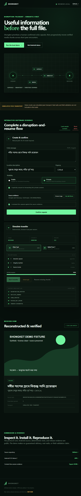

# Shongket 0.2.0 Local-Wi-Fi Demo Submission

## Project

Shongket is a semantic-first, disruption-tolerant multimedia distribution
protocol for crisis environments with partial connectivity. It sends a
human-confirmed critical capsule before progressively transferring verified
source-media chunks.

Repository owner: [Rifat-Hossain49](https://github.com/Rifat-Hossain49)

## Submission links

- Functional web demo:
  <https://rifat-hossain49.github.io/July_hackathon/>
- Source repository:
  <https://github.com/Rifat-Hossain49/July_hackathon>
- GitHub prerelease:
  <https://github.com/Rifat-Hossain49/July_hackathon/releases/tag/v0.2.0-local-wifi.1>
- Direct demo APK:
  <https://github.com/Rifat-Hossain49/July_hackathon/releases/download/v0.2.0-local-wifi.1/Shongket-0.2.0-local-wifi.1-debug.apk>

## Demonstration

1. Open the public web demo and choose **Run the local demo**.
2. Enter a Bengali or English crisis message or select **Load sample
   scenario**.
3. Use the generated source fixture or select a small local image.
4. Review the manually created capsule against the source evidence, then
   confirm it.
5. Choose public or private visibility. Private content requires explicit
   forwarding consent.
6. Select a simulated peer and start transfer.
7. Interrupt after the first media chunk, refresh the page if desired, and
   resume.
8. Observe that only missing chunks are requested, duplicate replay is
   ignored, the reconstructed SHA-256 matches, and the receiver view appears.
9. Export the content-free redacted diagnostics JSON.

The browser workflow above remains an in-device simulator. For actual nearby
exchange, install the Android APK on two phones, join them to the same Wi-Fi
network (or join one to the other phone's manually enabled hotspot), open the
app on both, tap **Start nearby Wi-Fi**, select the discovered peer and send a
human-confirmed text capsule. Internet service is not required.

## Functional scope

- Bengali and English crisis-message input.
- Manual, human-confirmed semantic capsule creation; no AI model required.
- Public/private handling with forwarding consent for private content.
- Capsule-before-manifest-before-media scheduling.
- Fixed-size chunk transfer, interruption, durable restart recovery, and
  missing-only resume.
- Duplicate suppression, per-fragment integrity checks, reconstruction, and
  source-byte equality verification.
- Received-item display and redacted diagnostics export.
- Browser-local state, no login, no analytics, and no silent network upload.
- Experimental foreground Android DNS-SD/mDNS discovery and bounded local TCP
  text-capsule exchange on a shared Wi-Fi network.

## Architecture

Pure protocol logic is isolated from user interfaces and transport adapters.
Semantic extraction, media processing, storage, diagnostics, and transport
have separate boundaries. The web demo is a dependency-free static
HTML/CSS/JavaScript application. The Android app is a Kotlin single-activity
application backed by the shared deterministic protocol concepts and durable
local state.

## Evidence

The screenshot shows an interrupted transfer after recovery: verified
progress is 100%, the missing-only resume requested chunk 1, one duplicate was
ignored, and received content was reconstructed with matching integrity.

## Limitations and disclosures

**SIMULATED PEER TRANSPORT**

The web demo uses simulated peer transport. The Android APK contains the
experimental local-Wi-Fi implementation, but physical-device and real-radio
validation have not been run.

- This is a functional software demo, not a production or field-validated
  emergency system.
- The published APK uses Android debug/demo signing and is not production
  signed.
- Real radios, physical-device testing, and field trials were not run.
- Delivery is disruption-tolerant but never guaranteed.
- No cloud AI is required or used by the offline demo core.
- The screenshot and bundled media are synthetic; source evidence is
  preserved and never silently replaced by generated capsule text.
