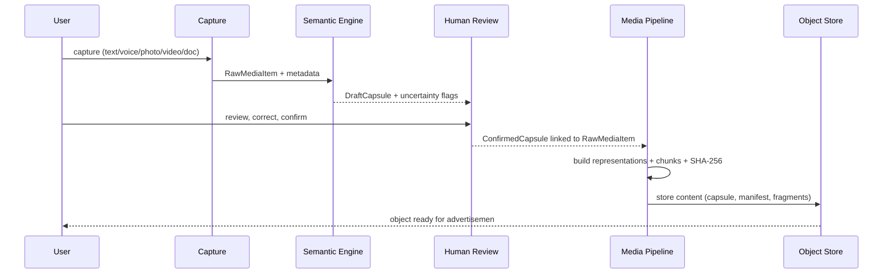
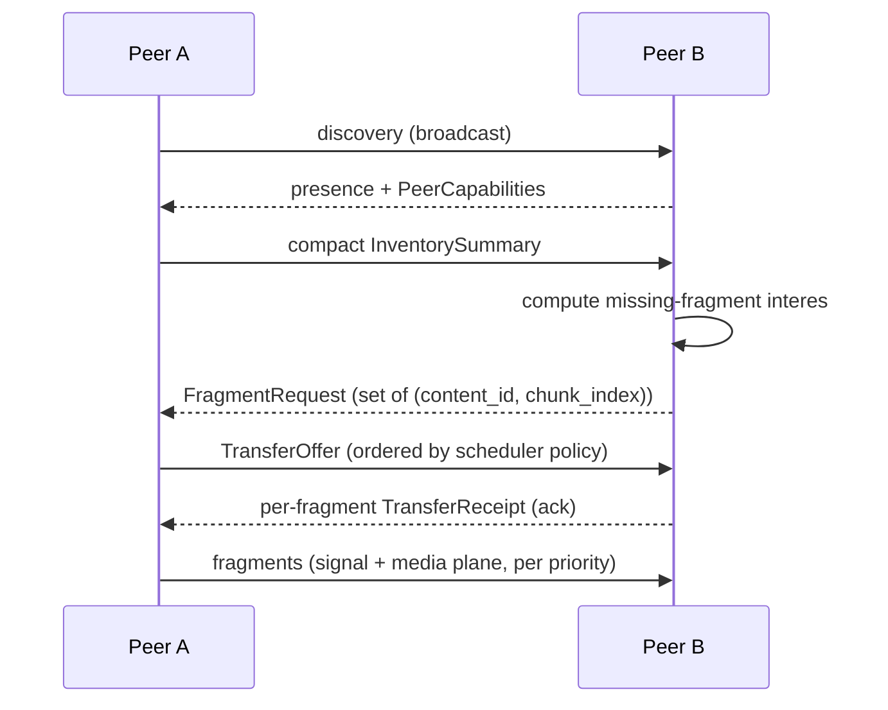
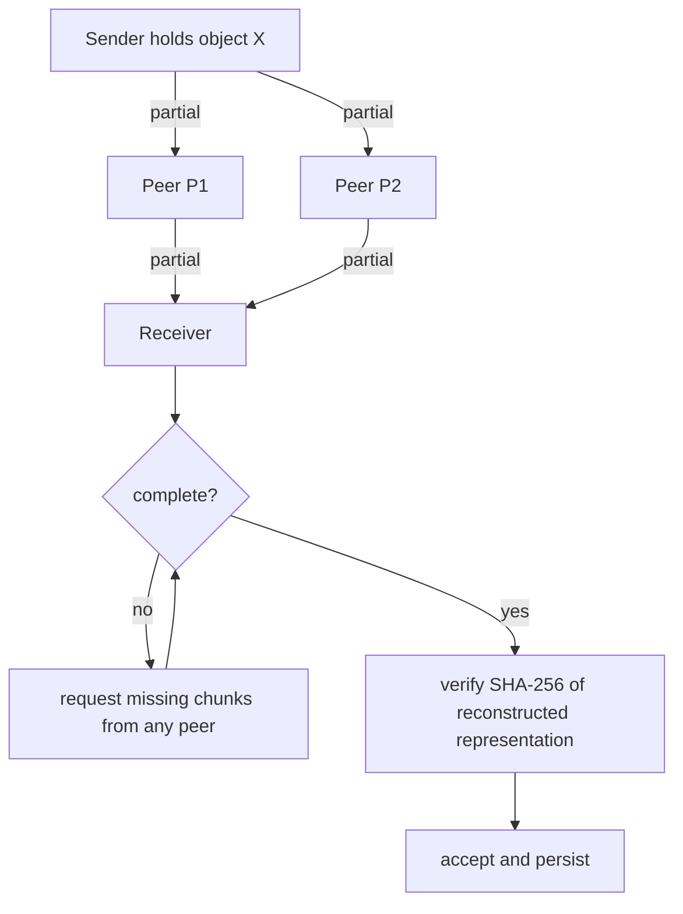
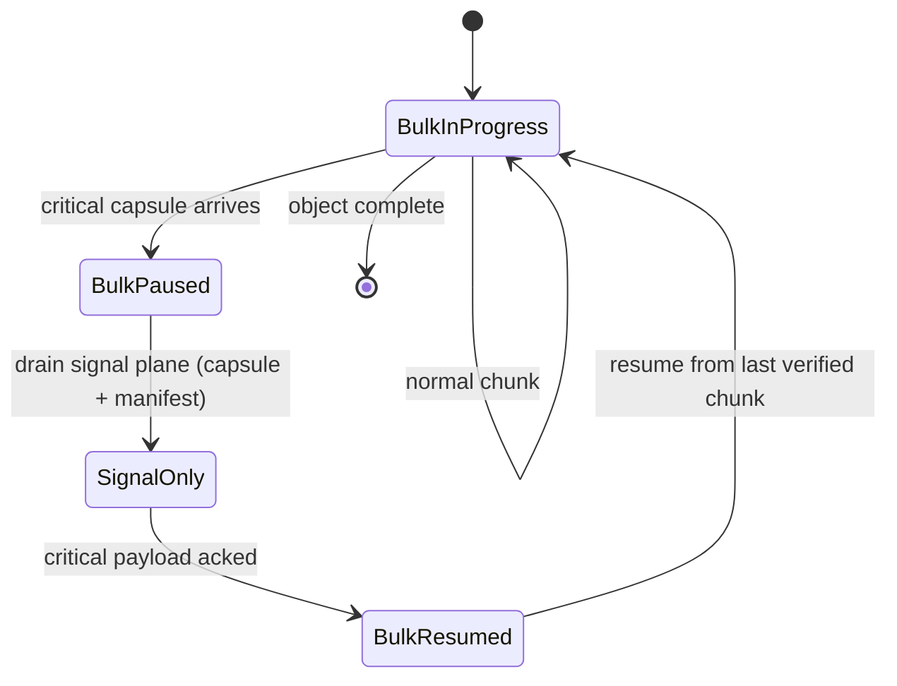

# Shongket — System Architecture

**Status:** M0 and M1 architecture implemented; M2 through M9 scope
frozen for a separately approved software-complete implementation.
Physical-device, real-radio and field behaviour remains unvalidated.

## 1. Architecture summary

```mermaid
flowchart LR
  subgraph Capture
    CI[Capture Interface]
  end
  subgraph Intelligence
    SE[Semantic Engine\n(offline, suggestion-only)]
    HR[Human Review Interface]
  end
  subgraph Conten
    MP[Media Pipeline]
    CAS[Content-Addressed Object Store]
    IV[Integrity Verifier]
    FI[Fragment Inventory]
    RE[Reconstruction Engine]
    PL[Persistence Layer]
  end
  subgraph Protocol
    SP[Signal Plane]
    ME[Media Plane]
    SC[Priority Scheduler]
    SY[Synchronization Engine]
    PC[Peer Capability Manager]
  end
  subgraph Radio
    TA[Transport Adapter]
    R1[Radio (M0: simulated; later: real radio)]
  end
  CI --> MP
  CI --> SE
  SE --> HR
  HR --> MP
  MP --> CAS
  MP --> IV
  CAS --> FI
  IV --> RE
  FI --> RE
  CAS --> PL
  FI --> PL
  HR --> SP
  CAS --> SP
  SC --> SY
  SP --> SY
  ME --> SY
  PC --> SY
  TA --> R1
  SY --> TA
  OBS[Observability / Logger] -.-> CI
  OBS -.-> SE
  OBS -.-> HR
  OBS -.-> MP
  OBS -.-> SY
  OBS -.-> SC
  OBS -.-> TA
  OBS -.-> RE
```

### 1.1 Explicit non-goals

Per `PRODUCT_DECISIONS.md` D-006 and `HACKATHON_BRIEF.md`:

- Guaranteed broadband or HD delivery between distant users.
- Claiming internet replacement when no high-bandwidth path exists.
- Becoming a generic Bluetooth / Wi-Fi Direct chat application.
- Replacing original media with AI-generated content.
- Treating AI output as factual truth.
- Cloud-dependent core.

---

## 2. High-level architecture

### 2.1 Component map

| Component | Responsibility | Inputs | Outputs |
|---|---|---|---|
| Capture Interface | Acquire text/voice/photo/video/document; collect raw metadata | Device sensors, user gesture | `RawMediaItem` + raw metadata |
| Semantic Engine (offline) | Propose structured fields; mark uncertainty | `RawMediaItem`, runtime | `DraftCapsule` with uncertainty flags |
| Human Review Interface | Let user correct, confirm, augment | `DraftCapsule`, original media | `ConfirmedCapsule` + linkage to media |
| Media Pipeline | Build progressive representations, chunk, hash | `RawMediaItem` | `Representation` set + `FragmentDescriptor[]` |
| Content-Addressed Object Store | Store capsules, manifests, fragments by content ID | anything with a content ID | stored / retrieved objects |
| Signal Plane | Exchange capsules, manifests, inventories, acks | peer messages | peer messages |
| Media Plane | Exchange thumbnails, previews, fragments | peer messages | peer messages |
| Priority Scheduler | Decide what to send next based on policy | local inventory, peer demand, priorities, budgets, expiry | `TransferPlan` |
| Synchronization Engine | Run discovery → inventory → negotiation → transfer | signal plane messages | state transitions |
| Transport Abstraction | Hide radio behind a single interface | `TransportAdapter` API | bytes in/out, peer events |
| Peer Capability Manager | Track what each peer can / will do | peer announcements | capability map |
| Fragment Inventory | Track which fragments we hold per object | local store | per-object fragment sets |
| Reconstruction Engine | Reassemble representations from fragments + recovery data | fragments + manifest | reconstructed bytes / files |
| Integrity Verifier | Hash and signature checks | bytes, manifests | accept / reject |
| Persistence Layer | Durable (or in-memory for M0) storage behind interface | all components | durable state |
| Optional Gateway | Future: bridge to a wider network if reachable | outbound interface | relayed bundles |
| Observability / Experiment Logger | Record metrics, accept/reject events, timings | all components | structured logs / metrics |

### 2.2 Plane separation (D-002)

**Signal plane** carries:
- semantic capsules;
- manifests and content IDs;
- priorities and capabilities;
- inventories and missing-fragment requests;
- acknowledgements, transfer-control, expiry.

**Media plane** carries:
- thumbnails, keyframes, short preview clips;
- standard-quality representations;
- original-quality representations;
- source and (later) recovery / parity fragments.

The two planes share identities but not transport framing. The
priority scheduler always prefers signal-plane traffic over
lower-priority media-plane traffic of equal or lower criticality
(D-009).

### 2.3 Trust boundaries

| Boundary | Trust level | Notes |
|---|---|---|
| Local user input | Trusted | source of truth for actions |
| Local AI output | Untrusted suggestion | never published without human confirmation (D-003) |
| Nearby peers | Untrusted | every payload validated, hashed, size-limited |
| Signed publishers | Identity trusted; facts still need confirmation | signer ≠ truth (per `AGENTS.md`) |
| Public content | Signer trust only; freshness / accuracy not implied | expiry enforced |
| Private content | Forwarding requires explicit user consent | never auto-forwarded |
| Optional gateway | Untrusted transport bridge | must not bypass integrity checks |
| External storage (SD card, etc.) | Untrusted host | fragments must be re-verified after read |

---

## 3. State and failure recovery

The system must survive each of the following without crashing or
silently corrupting state. Recovery behavior is logged so failures are
observable, not silent.

| Failure | Recovery |
|---|---|
| Application restart | durable persistence resumes; partial progress retained |
| Interrupted transfer | verified fragments retained; receiver can resume from another peer |
| Peer disappearance | in-flight requests time out; inventory is reconciled on next encounter |
| Duplicate reception | dedup by `(content_id, chunk_index, hash)` |
| Corrupted fragment | rejected, counted, transfer continues with other chunks |
| Insufficient storage | transfer paused, oldest / lowest-priority content evicted (policy explicit) |
| Low battery | lower transfer rate, defer bulk, keep signal plane hot |
| Transport failure | fallback to alternate `TransportAdapter` if available |
| Model failure | automatic fallback to manual form (D-011) |
| Malformed payload | reject, log, surface a generic protocol error to UI |
| Protocol-version mismatch | reject, do not partially process; surface clear error |

Note on "Insufficient storage": the eviction row above describes the
**device-side effect**, which remains later-milestone work (AT-12 is
scoped "M0 rule, M5+ effect"). Through M1 the behaviour is
**rejection-only** — see §3.2.

### 3.1 Durable persistence [IMPLEMENTED — M1, D-M1-06]

M0 used an in-memory store with a JSON snapshot. §2 records the
Persistence Layer as "durable (**or in-memory for M0**)"; M1 owes the
durable half.

**Format.** Canonical JSON, sorted keys, `(",", ":")` separators —
unchanged from M0, so existing snapshots stay readable. Schema-versioned
per `PROTOCOL_SPEC.md` §9.1.

**Integrity, two levels.** Each fragment keeps its SHA-256, and the
document gains a checksum over its canonical bytes excluding the
checksum field itself. Fragment-level integrity localises damage; the
document checksum detects truncation and tampering that per-fragmen
hashes alone would miss.

**Atomic write, in order:**

1. write to a temporary file in the destination directory;
2. `fsync` the temporary file;
3. `os.replace` onto the target path;
4. **`fsync` the parent directory.**

Step 4 is what M0 omitted. Without it the rename may not survive a
crash on POSIX even though the file contents were synced.

**Prior snapshot retained.** The previous document is kept until the new
one is durably written, which is what makes rollback possible.

**Locking.** M1 assumes **single-writer, multi-reader** per store path,
enforced by an advisory lock file. Multi-process writing is out of scope
until M2 defines it.

**Recovery matrix:**

| Condition | Behaviour |
|---|---|
| Truncated temporary file | Ignored and removed; last durable snapshot loads |
| Document checksum mismatch | File **quarantined** — renamed aside, never deleted — and the last good snapshot loads |
| Single fragment fails SHA-256 | That fragment is dropped; every intact fragment is preserved; the loss is logged |
| Snapshot version older than current | Migrated forward on read (§3.3) |
| Snapshot version newer than current | Refused with `VERSION_UNSUPPORTED`; nothing is modified |

A verified fragment is never lost by any recovery path except when its
own bytes are corrupt.

### 3.2 Storage pressure [IMPLEMENTED — M1, D-M1-04]

M1 is **rejection-only**. A write that does not fit the byte budget is
refused with `OUT_OF_BUDGET` (retryable) before any mutation; existing
fragments, byte accounting and persisted state are unchanged. **No
eviction is implemented in M1.**

Recorded for the M5+ eviction design, not implemented now: human-confirmed
capsules, manifests for objects holding any verified fragment, and the
original source representation must never be evicted.

### 3.3 Schema migration [IMPLEMENTED — M1, D-M1-06]

Migrations are pure functions `vN -> vN+1`, applied in order, each
independently testable. Migration is deterministic: identical inpu
bytes produce identical migrated bytes.

The pre-migration document is retained until the migrated document is
durably written. If any step or the final write fails, the original
remains readable and byte-identical — no partially migrated state is
ever visible. Re-opening an already-current store performs no migration.

### 3.4 Core and adapter boundary [IMPLEMENTED — M1, D-M1-08]

The deterministic core stays **Python and standard-library only** for
M1. A language-neutral protocol specification, canonical serialization
rules, golden vectors and conformance tests accompany it so a later por
can be validated against the same evidence. **No Kotlin port in M1.**

```
shongket_core/     platform-neutral: errors, schema, codec, validate,
                   policy, media, store, persist, migrate, evidence
adapters/
  simulator/       M0-compatible peers, encounters, scenarios, CLI
  platform/        RESERVED for M3+; no M1 conten
```

`shongket_core` must never import from `adapters/`, and must not depend
on Android or any non-standard-library package. The rule is enforced by
a conformance test rather than convention.

---

## 4. Architecture diagrams

### 4.1 Component architecture

```mermaid
flowchart LR
  subgraph Capture
    CI[Capture Interface]
  end
  subgraph Intelligence
    SE[Semantic Engine\n(offline, suggestion-only)]
    HR[Human Review Interface]
  end
  subgraph Conten
    MP[Media Pipeline]
    CAS[Content-Addressed Object Store]
    IV[Integrity Verifier]
    FI[Fragment Inventory]
    RE[Reconstruction Engine]
    PL[Persistence Layer]
  end
  subgraph Protocol
    SP[Signal Plane]
    ME[Media Plane]
    SC[Priority Scheduler]
    SY[Synchronization Engine]
    PC[Peer Capability Manager]
  end
  subgraph Radio
    TA[Transport Adapter]
    R1[Radio (M0: simulated; later: real radio)]
  end
  CI --> MP
  CI --> SE
  SE --> HR
  HR --> MP
  MP --> CAS
  MP --> IV
  CAS --> FI
  IV --> RE
  FI --> RE
  CAS --> PL
  FI --> PL
  HR --> SP
  CAS --> SP
  SC --> SY
  SP --> SY
  ME --> SY
  PC --> SY
  TA --> R1
  SY --> TA
  OBS[Observability / Logger] -.-> CI
  OBS -.-> SE
  OBS -.-> HR
  OBS -.-> MP
  OBS -.-> SY
  OBS -.-> SC
  OBS -.-> TA
  OBS -.-> RE
```

### 4.2 Object creation flow



### 4.3 Peer synchronization flow



### 4.4 Interruption and multi-peer reconstruction



### 4.5 Critical-content preemption



---

## 5. MVP exclusions (M0 and M1)

The following are **not** part of M0 or M1 and are tracked under later
milestones:

- Android-specific transport APIs (M3+).
- Real radio usage (M3+).
- Offline AI model runtime on device (M6+).
- Production end-to-end encryption with key management (later).
- Advanced routing / utility-based forwarding (later experiment, not M0).
- Full erasure / fountain coding (later research, behind
  `FragmentationStrategy`; not part of M0–M5).
- Standards-based mesh claims without implemented standards.
- Cloud-dependent features.

---

## 6. Boundary interfaces

M0/M1 implement the deterministic bindings named below. The remaining
bindings are frozen contracts for M2 through M9; an interface entry does
not claim that its Android or radio binding exists.

| Interface | Purpose | Current/frozen binding |
|---|---|---|
| `TransportAdapter` | Send/receive bytes, surface peer events | simulated adapter |
| `FragmentationStrategy` | Split / recombine a representation | fixed-size chunker |
| `Persistence` | Store and retrieve keyed objects | M1 canonical snapshot envelope |
| `SemanticExtractor` | Produce `DraftCapsule` | manual/unavailable default; deterministic test double |
| `MediaPipeline` | Build representations from `RawMediaItem` | synthetic now; platform adapter frozen |
| `IntegrityVerifier` | Hash/signature verification | SHA-256; signing behind key-store port |
| `IdentityProvider` | Sign/verify signed manifests | development-only fixtures until manual release gate |
| `Scheduler` | Decide next transfer | deterministic M1 policy |
| `InventoryIndex` | Per-object fragment tracking | exact fragment map |
| `Observability` | Emit metrics and content-free evidence | deterministic evidence log |

### 6.1 Transport adapter tree

The `TransportAdapter` interface is the boundary between protocol
logic and physical media. No specific radio is locked. Concrete
adapters planned per milestone:

- `SimulatedTransportAdapter` — **Milestone 0**. In-process bytes
  pipe with deterministic loss / reorder / drop profiles. Used by
  the M0 simulator and by the M1 conformance suite.
- `LocalProcessTransportAdapter` — **Milestone 2**. Two processes on
  the same host exchanging bytes over a local socket. Verifies tha
  the protocol survives real OS process boundaries and real socke
  failure modes without committing to any radio.
- `AndroidTransportAdapter` — **Milestone 3, provisional**. Wraps
  Android radios. The specific radio (Nearby Connections,
  Wi-Fi Direct, hotspot + LAN, Wi-Fi Aware, BLE for control) is
  **not** selected in this plan; selection is gated by the M3
  transport smoke-test gate.

A labeled diagram in §4.1 must show `TransportAdapter` as a single
node, not split by radio. The radio lives behind the adapter.

### 6.2 ReconstructionEngine semantics

In M0, `ReconstructionEngine` performs **ordinary verified-chunk
reassembly**. It accepts a content object only when every chunk
indexed by the manifest is present and SHA-256-verified.

Coded reconstruction (Reed-Solomon, fountain, RaptorQ) is **not** an
M0 capability. It is a later research extension behind
`FragmentationStrategy` and is tracked in
[MILESTONES.md](./MILESTONES.md) §"Later research extension — Coded
delivery".

### 6.3 Remaining software architecture freeze

```tex
shongket_core/              canonical Python behaviour and vectors
app/simulator/              completed M0 harness; frozen
adapters/process/           M2 frame codec and stdio/loopback endpoints
adapters/transport_sim/     deterministic adapter conformance binding
android/core-conformance/   Kotlin vector-conformant codec
android/data-persistence/   app-private canonical envelope
android/data-transport/     simulated and provisional radio adapters
android/media/              capture, representations and playback state
android/semantic/           manual path and optional extractor por
android/security/           key-store, signing and consent adapters
android/ui/                 single-activity Compose UI state
android/app/                assembly, permissions and background work
android/diagnostics/        explicit content-free evidence expor
```

The dependency direction is one-way: adapters and applications consume
the protocol/domain contracts; the core imports no Android, adapter,
model or transport runtime. Deterministic admission, capability
negotiation outcomes, fragment integrity, scheduling and storage
accounting are never delegated to an LLM or a radio adapter.

Application persistence stores durable domain state. `SavedStateHandle`
or equivalent lifecycle state stores only small UI identifiers needed
to recreate a screen; it is not a substitute for the canonical store.
The background-work port must tolerate process death and resume from
that store. No Android service is assumed immortal.

Every network boundary validates the 1,048,576-byte frame limit before
parse, canonical schema limits before mutation, and fragment integrity
before storage. Test doubles implement the same interfaces and may no
relax those checks.

---

## 7. Decision records

### DR-ARCH-01 — Plane separation

- Decision: signal plane and media plane are logical layers; same
  transport adapter may carry both, framed distinctly.
- Alternatives: single-plane unified protocol; out-of-band signaling only.
- Recommended: signal/media split.
- Reason: enables D-002 + D-009 priority preemption and D-007 progressive
  delivery without coupling semantics to bulk transfer mechanics.
- Evidence required: M0 success criteria 1–3.
- Trade-offs: two framing stacks to maintain.
- Risks: framing bugs causing media-plane delivery to starve signal plane
  — mitigated by scheduler priority and explicit queue inspection in tests.
- Validation: AT-01, AT-04 and AT-05 in `ACCEPTANCE_TESTS.md`.
- Revisit condition: if M0 cannot demonstrate measurable preemption
  latency improvement over single-plane baseline.

### DR-ARCH-02 — Deterministic forwarding policy in M0

- Decision: M0 uses deterministic, auditable forwarding policy
  (criticality, layer order, peer demand, expiry, hop limit, copy
  budget, completion %).
- Alternatives: utility-based forwarding; unrestricted epidemic;
  user-selected forwarding.
- Recommended: deterministic policy in M0; utility-based as later
  experiment in `EXPERIMENT_PLAN.md`.
- Reason: reproducibility, testability, auditability — required to
  validate the central protocol claim without confounding variables.
- Evidence required: M0 success criteria 1, 3, 9.
- Trade-offs: lower adaptivity in M0.
- Risks: may underperform a learned policy in real traffic.
- Validation: `EXPERIMENT_PLAN.md` falsifiable hypotheses H-FWD-1..H-FWD-3.
- Revisit condition: M5+ evaluation of utility-based vs deterministic.

### DR-ARCH-03 — Multi-peer reconstruction ≠ coded reconstruction

- Decision: M0 multi-peer reconstruction is ordinary missing-chunk
  completion only.
- Alternatives: include erasure / rateless coding in M0.
- Recommended: ordinary chunks in M0; coded path is later research.
- Reason: keep M0 scope honest; do not describe behavior that isn'
  implemented.
- Evidence required: M0 success criterion 5.
- Trade-offs: lower robustness to peer disappearance in M0.
- Risks: evaluators may misread M0 as demonstrating coding.
- Validation: `EXPERIMENT_PLAN.md` distinguishes the two paths.
- Revisit condition: post-M5 decision on coding extension.

### DR-ARCH-04 — Provisional transport; smoke-test gate

- Decision: Nearby Connections is provisional first adapter. No
  transport is locked until a real-device smoke-test gate passes.
- Alternatives: Wi-Fi Direct; local hotspot + LAN; BLE control only.
- Recommended: provisional Nearby Connections, alternatives kept in
  research.
- Reason: avoid pre-locking a transport that may fail the gate on
  intended demo devices.
- Evidence required: gate criteria in `RESEARCH_LOG.md` §Transport.
- Trade-offs: slower M3 plan until gate passes.
- Risks: gate failure leaves M3 without a transport.
- Validation: `ACCEPTANCE_TESTS.md` transport smoke tests.
- Revisit condition: gate result.
